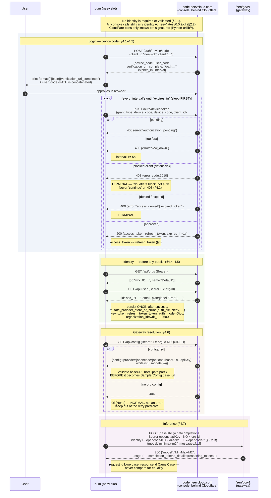

# NeevCloud Protocol Reference

Normative spec for the `neev` provider slot. The implementation is written against this document; where code and this document disagree, this document is right and the code is a bug.

## Provenance — read this first

Two independent sources produced this spec. Every claim below is tagged.

| Tag | Meaning |
| --- | --- |
| **VERIFIED-LIVE** | Confirmed by an authenticated HTTP call against `https://code.neevcloud.com` using Cristian's real account. Response shapes below are the real ones, secrets redacted to `sk-…`. |
| **BINARY** | Read out of the Bun-compiled `@neevcode/neev@0.0.2` binary (the embedded JS is plain text). Structurally reliable, but not exercised against the live service in this round. |
| **CAPTURED** | Read off the wire from a real `neev` run through a TLS-intercepting proxy (mitmproxy, decrypted). Verbatim header values. Used only for the client-identity sets in §2.2; `07-wire-fidelity.md` is their owner. |

Anything not tagged is derived reasoning, marked as such inline. **NOT VERIFIED** marks a genuine unknown.

There is no vendor documentation. There is no OpenAPI spec. This file is the spec.

**Path convention:** bare `auth/…` and `agent/…` citations below are relative to `crates/codegen/xai-grok-shell/src/`. The auth flow lives in the **shell** crate, not in `xai-grok-auth` (which holds only `auth_provider.rs`, `retry_middleware.rs`, `visibility.rs`). Other crates are cited with a full path.

---

## 1. Constants

| Constant | Value | Source |
| --- | --- | --- |
| Console base URL (prod) | `https://code.neevcloud.com` | VERIFIED-LIVE |
| Console base URL (dev) | `https://dev.code.neevcloud.com` | BINARY |
| Env override | `NEEVCLOUD_CONSOLE_URL` | BINARY |
| OAuth `client_id` | `neev-cli` | BINARY (constant `HK`) |
| Early-refresh window | refresh when `expiry < now + 5 minutes` | BINARY |
| Inference base URL | `https://code.neevcloud.com/zen/go/v1` | VERIFIED-LIVE (returned by §6, not a constant — see the warning there) |

Trailing slashes on the console URL are stripped before use. The tree already has this idiom — `trim_end_matches('/')` at `auth/codex/device.rs:27`, `:35`, `:41` and `auth/device_code.rs:221` — match it rather than inventing a normalizer.

`NEEVCLOUD_CONSOLE_URL` breaks the tree's `GROK_`/`BUM_` env-prefix convention. It is the vendor's name and stays verbatim; see `04-conventions-and-gotchas.md`.

---

## 2. Client identity: nothing is required, we send the real thing anyway

Two facts that coexist without contradiction:

1. **Nothing on this service validates client identity today.** Not the UA, not the custom headers, not the ids. Measured, below.
2. **The port sends the neev CLI's exact identity anyway.** Adopted decision (Cristian's) — forward-compatibility insurance against a future version gate, meter, or rate limit keyed on client identity. Spec: **`07-wire-fidelity.md`**, which owns the strings, the constants module, and the maintenance story. This section states only what the protocol requires (nothing) and which identity belongs on which endpoint.

Corollary of (1), and it is load-bearing during debugging: **fidelity can never be the cause of a failure.** If a NeevCloud call breaks, look at auth, org scoping, or the body first. Never at the headers in §2.2.

### 2.1 Measured: identity is not enforced

VERIFIED-LIVE against the gateway (`/zen/go/v1/chat/completions`, authenticated):

| Sent | Result |
| --- | --- |
| bare request, no fidelity headers at all | **200** |
| full neev fidelity (UA + all `x-opencode-*`) | **200** |
| console UA on the gateway (mismatched identity) | **200** |
| malformed `x-opencode-session: NOT_A_VALID_ID` | **200** |

Console side, VERIFIED-LIVE against `/api/orgs`, authenticated:

| User-Agent sent | Result |
| --- | --- |
| none — curl's default `curl/8.x` | **200** |
| empty string | **200** |
| `neev/latest/0.0.2/cli` | **200** |
| `Python-urllib/3.13` | **403 / 1010** |

The 403 body is Cloudflare's, not a JSON auth error:

```json
{ "error_code": 1010, "error_name": "browser_signature_banned" }
```

The block is signature-based, not allowlist-based: the *same* Python `urllib` client that 403s with its default UA returns 200 the moment it sends any other UA — even `curl/8.0`. An empty UA and curl's default both sail through.

**There is no UA requirement, and the block is not the reason we send a UA.** A Rust `reqwest` client never sends `Python-urllib/*`; the harness's shared client UA — `grok-shell/<ver> (os; arch)` from `xai_grok_http::shared_client()` (`crates/codegen/xai-grok-http/src/lib.rs:282`, `.user_agent(process_user_agent_string())` at `:289`) — would work, and so would reqwest's default. The UA we do send is a **fidelity** choice (§2, `07-wire-fidelity.md`), not a Cloudflare workaround. The inference gateway (`/zen/go/v1`) is not UA-gated at all.

Still true regardless:

- Do **not** build a second `reqwest::Client`. `shared_client()`'s doc comment (`lib.rs:274-281`) documents the pool health-checking as specifically necessary behind Cloudflare/LBs. Fidelity is applied per request, on top of `shared_client()`.
- `xai_grok_http::set_client_name` / `GROK_CLIENT_NAME` (`lib.rs:164`, `:241`) is process-global and `expect`s on a second call — it would rewrite the UA for xAI and Codex traffic too. It is **not** the mechanism for a per-provider UA; a per-request `.header(USER_AGENT, …)` is.
- Error handling (defensive, ~5 lines): give 403 its own named arm — e.g. `BlockedClient` for 403 + `error_code: 1010`. Not because you will hit it, but because a 403 reads like an auth failure and Cloudflare rules are the vendor's to change at any time. The codex template's generic arm (`auth/codex/device.rs:253`) prints `device auth failed with HTTP {status}`, which hides the cause.

### 2.2 The two identities, and which endpoints get which

Captured by TLS-intercepting a real `neev` run (mitmproxy, decrypted). Values verbatim; `07-wire-fidelity.md` §2 is the owner — it carries the UA-template decomposition, the constants module, the env overrides, and the provenance caveats. Do not hardcode these strings anywhere but that module.

**A. Console / catalog identity** — every `{base}/auth/*` and `{base}/api/*` call (§4.1–4.6, §4.8, §4.9):

```
User-Agent: neev/latest/0.0.2/cli
Accept: */*                        # "application/json" on /api/config
Accept-Encoding: gzip, deflate, br, zstd
Connection: keep-alive
b3: <trace>-<span>-1-<parent>      # OTel B3      — 07 §5 recommends SKIPPING both
traceparent: 00-<trace>-<span>-01  # W3C
```

**B. Inference gateway identity** — `{baseURL}/chat/completions` only (§4.7):

```
User-Agent: opencode/0.0.2 ai-sdk/provider-utils/4.0.23 runtime/bun/1.3.13
x-opencode-client: cli
x-opencode-project: global
x-opencode-session: ses_<26-char ULID-ish>   # fresh per session — never replay
x-opencode-request: msg_<26-char ULID-ish>   # fresh per message
Accept: */*
Accept-Encoding: gzip, deflate, br, zstd
Connection: keep-alive
```

Provenance caveat on B: captured against `opencode.ai/zen/v1` (logged-out free tier), because the intercepted container was not logged into NeevCloud. It is the same AI-SDK code path that serves the NeevCloud gateway (provider key `opencode`; only `baseURL`/`apiKey` differ), so the same headers apply — a **strong inference, not a direct capture**.

Do not mix them: the console UA on the gateway is a mismatched identity (it 200s today, but it defeats the entire point). And do not copy neev's `opencode/0.0.2` ripgrep-download UA or npm's UA — those are not neev's identity (`07-wire-fidelity.md` §2C).

**The strings go stale.** `0.0.2`, `4.0.23`, `bun/1.3.13`, `latest` are pinned to a moving target; if NeevCloud ever enforces a *minimum* client version, the insurance policy becomes the outage. One constants module, env-overridable, re-derivable by re-running the capture — `07-wire-fidelity.md` §7–§8.

---

## 3. Token identity — the single most consequential finding

**VERIFIED-LIVE (SHA256-compared):** for a given account,

```
access_token  ==  refresh_token  ==  /api/config → config.provider.opencode.options.apiKey
```

All three are byte-identical: one 67-char `sk-…` string, `expires_in` ≈ **1 year**.

Protocol consequences, each of which changes an implementation decision:

1. **The flow is OAuth-shaped but delivers one long-lived static bearer.** RFC 8628 grammar, no rotation.
2. **Refresh is a near-no-op.** POST returns the same bytes with a fresh expiry. Implement it anyway — the store's `TokenType` dispatch (`auth/token_type.rs`) keys on `AuthMode::Oidc` **with** a `refresh_token`; `Oidc` *without* one silently degrades to the unrefreshable `LegacySession`. Store the same string in `GrokAuth.key` and `GrokAuth.refresh_token`.
3. **The inference key IS the account session.** Leaking the LLM key leaks the console account. This sharpens the tree's existing "never echo an HTTP response body into an error" rule (`auth/codex/device.rs:252` — `// Do not include body (may leak tokens)`) from "may leak a token" to "leaks the whole account".
4. **A revoked token still looks fresh.** `expires_at` is a year out, so `is_expired_with_buffer` (`auth/model.rs:444`) is false the whole time and `ensure_fresh` effectively never fires. Revocation only surfaces as a 401 at the gateway. Do not build revocation detection into the store — let the sampler's 401 path drive re-login.
5. Redaction is free: `crates/codegen/xai-grok-secrets/src/sanitizer.rs:10-11` compiles `\b(?:sk[-_]|xai-)[A-Za-z0-9_-]{20,}`, which already matches a 67-char `sk-…`. Add no pattern.

**Do not depend on this identity for correctness.** It is an observed fact about today's server, not a contract. Fetch `options.apiKey` from §6 and use it as the gateway bearer; if the server ever splits them, the code keeps working. Persisting the apiKey separately in `auth.json` would duplicate a secret for nothing — see `03-storage-and-slots.md`.

**Storage note:** neev's own CLI stores this token in a **world-readable (0644)** SQLite DB. That is a real weakness and MUST NOT be ported. bum's auth store writes 0600 through `open_secure_file` (`crates/codegen/xai-grok-shell-base/src/util/secure_file.rs:72`) on every path including the disk-full fallback — use the existing API and this is free.

---

## 4. Endpoints

Notation: `{base}` = console base URL, no trailing slash. `<TOKEN>` = the `sk-…` bearer. `<ORG>` = a `wrk_…` id from §4.5.

Each endpoint's header table lists what the protocol **requires**. On top of that, every `{base}` call carries the console fidelity set (§2.2 A) and the gateway call carries the AI-SDK set (§2.2 B) — required by nothing, sent by decision. The curl examples show the UA only; they are minimal repros, not the full fidelity set.

### 4.1 POST `{base}/auth/device/code` — device authorization

Source: **BINARY**. Note this is JSON-bodied, *not* form-encoded — unlike RFC 8628 §3.1 and unlike xAI's flow (`auth/device_code.rs`). It matches the Codex shape, which is why `auth/codex/device.rs` is the file to mirror.

**Headers**

| Header | Value |
| --- | --- |
| `Content-Type` | `application/json` |

No auth. No UA requirement (§2.1) — send the console fidelity set anyway (§2.2 A).

**Request**

```json
{
  "client_id": "neev-cli",
  "client": "neev CLI 0.0.2 on linux"
}
```

`client` is a free-form human label, rendered by the vendor CLI as `neev CLI ${version} on ${platform}`. It is displayed on the approval page. Send bum's own equivalent.

**Response 200**

```json
{
  "device_code": "…",
  "user_code": "…",
  "verification_uri_complete": "/…",
  "expires_in": …,
  "interval": …
}
```

Only the **field set** is BINARY-sourced. The `user_code` format, the exact `verification_uri_complete` path, and the `expires_in`/`interval` values are **NOT VERIFIED** — do not hardcode or assert on them. Parse `interval` and `expires_in` from the response (§4.2).

> ### ⚠ `verification_uri_complete` is a PATH, not an absolute URL
>
> The server returns a path. The URL shown to the user is **concatenated**:
>
> ```rust
> let display_uri = format!("{base}{}", resp.verification_uri_complete);
> ```
>
> This is a real quirk, preserve it. Codex's `codex_device_verify_url` (`auth/codex/device.rs:40`) builds an absolute URL from the issuer — a structural copy-paste prints a broken link.
>
> It also collides with the existing guard: `validate_verification_uri` (`auth/device_code.rs:521`) does `url::Url::parse` and demands `https` (or loopback `http`), so a bare path fails to parse. **Concatenate first, then validate the result.** Do not delete the guard to make it pass — it is what rejects control chars and non-https schemes.

**curl**

```bash
curl -sS -X POST https://code.neevcloud.com/auth/device/code \
  -H 'User-Agent: neev/latest/0.0.2/cli' \
  -H 'Content-Type: application/json' \
  -d '{"client_id":"neev-cli","client":"bum CLI 0.1.0 on linux"}'
```

**Errors**

| Condition | Response |
| --- | --- |
| Banned-bot UA signature (e.g. `Python-urllib/*`) | 403, Cloudflare body `{"error_code":1010,"error_name":"browser_signature_banned"}`. Not reachable from reqwest — handle defensively (§2). |
| Other non-2xx | NOT VERIFIED. Fail closed; never echo the body. |

---

### 4.2 POST `{base}/auth/device/token` — token poll

Source: **BINARY** for the request shape; the RFC 8628 error set is BINARY + protocol-standard.

Poll every `interval` seconds until `expires_in` elapses.

**Headers**: `Content-Type: application/json`. No auth. Console fidelity set (§2.2 A).

**Request**

```json
{
  "grant_type": "urn:ietf:params:oauth:grant-type:device_code",
  "device_code": "…",
  "client_id": "neev-cli"
}
```

The grant-type literal already exists in-tree as `DEVICE_GRANT_TYPE` (`auth/device_code.rs:19`) — reuse it, do not re-declare.

**Response 200**

```json
{
  "access_token": "sk-…",
  "refresh_token": "sk-…",
  "expires_in": 31536000
}
```

Per §3, `access_token == refresh_token`.

**Error responses** — standard RFC 8628 OAuth error bodies:

| `error` | Meaning | Client action |
| --- | --- | --- |
| `authorization_pending` | user hasn't approved yet | continue polling at current interval |
| `slow_down` | polling too fast | `interval += 5s`, continue |
| `expired_token` | device code expired | terminal — tell the user to re-run `bum login --provider neev` |
| `access_denied` | user rejected | terminal |
| — | HTTP 403 + `error_code: 1010` | terminal — **a Cloudflare client block, not an auth failure**; say so |

**Poll-loop requirements** (all three exist in the templates; keep them):

- **Sleep first, poll second.** `auth/codex/device.rs:200` sleeps before the first request; the rationale is spelled out at `auth/device_code.rs:231` — an immediate poll on a fresh code only returns `authorization_pending` and risks tripping `slow_down`.
- **`slow_down` → `+5s`**, matching `SLOW_DOWN_INCREMENT_SECS` (`auth/codex/device.rs:20`) and `DEVICE_SLOW_DOWN_INCREMENT_SECS` (`auth/device_code.rs:21`).
- **Deadline from the server's `expires_in`**, floored — NeevCloud actually returns `expires_in`, so use it rather than Codex's flat `MAX_WAIT = 15min` (`auth/codex/device.rs:21`). Reuse the xAI floor idiom: `expires_in.max(MIN_DEVICE_CODE_EXPIRY_FALLBACK_SECS)` (`auth/device_code.rs:22`, `:223-228`).

Do **not** copy Codex's "treat 403/404 as pending" arm (`auth/codex/device.rs:249-251`). It `continue`s on 403/404, so **any** unexpected 403 — Cloudflare or otherwise — spins silently until `MAX_WAIT` (15 min) instead of erroring. That is a real trap in the code being copied, independent of anything UA-related: an unexpected 403 must fail loudly and specifically rather than hang for a quarter hour on a one-line message.

**curl**

```bash
curl -sS -X POST https://code.neevcloud.com/auth/device/token \
  -H 'User-Agent: neev/latest/0.0.2/cli' \
  -H 'Content-Type: application/json' \
  -d '{"grant_type":"urn:ietf:params:oauth:grant-type:device_code",
       "device_code":"'"$DEVICE_CODE"'",
       "client_id":"neev-cli"}'
```

---

### 4.3 POST `{base}/auth/device/token` — refresh

Source: **BINARY**. Same URL as the poll; discriminated only by `grant_type`.

**Request**

```json
{
  "grant_type": "refresh_token",
  "refresh_token": "sk-…",
  "client_id": "neev-cli"
}
```

**Response 200**

```json
{
  "access_token": "sk-…",
  "refresh_token": "sk-…",
  "expires_in": 31536000
}
```

Returns the same bytes with a fresh expiry (§3). Trigger when `expires_at < now + 5min` — which is already the harness default, `DEFAULT_EARLY_INVALIDATION_SECS = 300` (`auth/model.rs:8`), read via `early_invalidation()` (`auth/model.rs:429`). Add no new constant.

**curl**

```bash
curl -sS -X POST https://code.neevcloud.com/auth/device/token \
  -H 'User-Agent: neev/latest/0.0.2/cli' \
  -H 'Content-Type: application/json' \
  -d '{"grant_type":"refresh_token","refresh_token":"sk-…","client_id":"neev-cli"}'
```

**Errors**: NOT VERIFIED beyond the standard set. Classify `invalid_grant` → refresh token rejected (permanent, drop the slot) and `invalid_client` → client rejected (permanent), mirroring `classify_terminal` (`auth/codex/refresh.rs:25`). Everything else is transient — see §8 on why that distinction is load-bearing.

---

### 4.4 GET `{base}/api/user`

Source: **VERIFIED-LIVE**.

**Headers**

| Header | Value |
| --- | --- |
| `Authorization` | `Bearer <TOKEN>` |
| `x-org-id` | `<ORG>` |

Plus the console fidelity set (§2.2 A).

**Response 200** (real shape, ids truncated)

```json
{
  "id": "acc_01…",
  "email": "cristian@wishday.ai",
  "name": "",
  "workspaceName": "Default",
  "plan": {
    "type": "basic",
    "label": "Free",
    "tokenLimit": 10000000,
    "tokenUsed": 67,
    "endDate": "2026-08-14T15:10:36.036Z",
    "status": "active"
  },
  "billingUrl": "https://code.neevcloud.com/workspace/wrk_01…/billing"
}
```

`name` came back empty on the live account — treat it as optional.

**curl**

```bash
curl -sS https://code.neevcloud.com/api/user \
  -H 'User-Agent: neev/latest/0.0.2/cli' \
  -H "Authorization: Bearer $NEEV_TOKEN" \
  -H "x-org-id: $NEEV_ORG"
```

Field use: `id` → `GrokAuth.user_id`, `email` → `GrokAuth.email`, `plan.label` → the derived `ProviderAuthStatus.plan` (`auth/status.rs:19`; `format_auth_status` at `:234` already renders it, and renders an em-dash for `None`). `plan` is **not** a `GrokAuth` field — don't add one.

---

### 4.5 GET `{base}/api/orgs`

Source: **VERIFIED-LIVE**.

**Headers**: `Authorization: Bearer <TOKEN>`, plus the console fidelity set (§2.2 A). **No `x-org-id`** — this is the call that tells you what it is.

**Response 200**

```json
[{ "id": "wrk_01KXK57HB8CS254F90YA66Y8KB", "name": "Default" }]
```

A bare array. The live account returned exactly one org.

**curl**

```bash
curl -sS https://code.neevcloud.com/api/orgs \
  -H 'User-Agent: neev/latest/0.0.2/cli' \
  -H "Authorization: Bearer $NEEV_TOKEN"
```

Call this **immediately after** a successful token exchange, inside the login's `build_auth` equivalent, and persist the first org's id. `x-org-id` is required by §4.6, so a login that skips this leaves the gateway unresolvable on a cold start.

Store it in the existing `GrokAuth.organization_id` (`auth/model.rs:144`) — precedent: `CodexAuthMaterial::from_auth` (`auth/codex/ensure_fresh.rs:30`) maps `organization_id` → `account_id` for header construction. `name` → `GrokAuth.organization_name`. `GrokAuth` needs no new fields.

**Multi-org**: NOT VERIFIED — what a multi-org account returns, and whether org order is stable, is unknown. Taking the first is the lazy correct default; revisit if a user reports a wrong workspace.

---

### 4.6 GET `{base}/api/config` — **the call that makes the gateway work**

Source: **VERIFIED-LIVE** (the live call returned a real key; redacted below).

**Headers**

| Header | Value |
| --- | --- |
| `Authorization` | `Bearer <TOKEN>` |
| `x-org-id` | `<ORG>` — **required**, from §4.5 |

Plus the console fidelity set (§2.2 A). This is the one call where the vendor CLI's `Accept` is `application/json`, not `*/*` — it pipes `acceptJson`.

**Response 200**

```json
{
  "config": {
    "provider": {
      "opencode": {
        "name": "NeevCode Zen",
        "options": {
          "baseURL": "https://code.neevcloud.com/zen/go/v1",
          "apiKey": "sk-…"
        },
        "whitelist": [
          "minimax-m2", "minimax-m3", "qwen3.6-plus", "qwen3.7-plus",
          "qwen3.7-max", "deepseek-v4-pro", "glm-5.2", "nemotron-3-ultra"
        ],
        "models": {
          "minimax-m2": {
            "name": "MiniMax M2",
            "tool_call": true,
            "reasoning": true,
            "provider": { "npm": "@ai-sdk/openai-compatible" },
            "limit": { "context": 196608, "output": 32768 },
            "cost": { "input": 3e-07, "output": 1.2e-06 }
          }
        }
      }
    },
    "enabled_providers": "…",
    "disabled_providers": "…"
  }
}
```

**The provider key is literally `"opencode"`** — upstream fork heritage — even though the display name is `"NeevCode Zen"`. Do not key off the display name.

`options.baseURL` + `options.apiKey` **are** the inference credentials. Everything in §7 depends on this call.

**HTTP 404 = "no config" = `None`, not an error.** VERIFIED as normal for an org without a config. Model it as `Ok(None)`, say so in the doc comment, and keep 404 out of any retry predicate (`xai_grok_http::send_with_retry_escaping_pool`, `lib.rs:432`, takes an `is_retryable` closure). There is in-tree precedent for the typed-404 shape: `auth/device_code.rs:167` maps 404 → `DeviceCodeError::NotEnabled`.

**curl**

```bash
curl -sS https://code.neevcloud.com/api/config \
  -H 'User-Agent: neev/latest/0.0.2/cli' \
  -H "Authorization: Bearer $NEEV_TOKEN" \
  -H "x-org-id: $NEEV_ORG"
```

> ### ⚠ Security: the server names the host that receives the account secret
>
> `options.baseURL` is fetched from a server response at runtime. Combined with §3 (the bearer is the whole account), a hostile or compromised `/api/config` could point the secret at an arbitrary host. This is structurally unlike xAI and Codex, whose bases are compile-time constants.
>
> Validate the returned `baseURL` against an allowlist — host `code.neevcloud.com` (+ `dev.code.neevcloud.com`, + whatever `NEEVCLOUD_CONSOLE_URL` names) **and** the `/zen/go/v1` path prefix — before it becomes a `SamplerConfig.base_url`. `is_first_party_codex_url` (`agent/config.rs:4499`) documents that host-only matching is insufficient; the same reasoning applies harder here, because for NeevCloud the console and the gateway are the *same host* differing only by path.

Model-field mapping (`limit.context` → `context_window`, `cost.*` → nowhere, `reasoning` → do not map to `supports_reasoning_effort`, etc.) is out of scope here — see `05-catalog-and-routing.md`.

---

### 4.7 POST `{baseURL}/chat/completions` — inference gateway

Source: **VERIFIED-LIVE**.

`baseURL` comes from §4.6 = `https://code.neevcloud.com/zen/go/v1`. Plain **OpenAI-compatible Chat Completions**. No NeevCloud-specific body fields, and no *required* NeevCloud-specific headers.

**Headers — required**

| Header | Value |
| --- | --- |
| `Authorization` | `Bearer <options.apiKey>` |
| `Content-Type` | `application/json` |

**Headers — fidelity (identity B, §2.2 B)**, none of them required, all of them sent:

| Header | Value |
| --- | --- |
| `User-Agent` | `opencode/0.0.2 ai-sdk/provider-utils/4.0.23 runtime/bun/1.3.13` |
| `x-opencode-client` | `cli` |
| `x-opencode-project` | `global` |
| `x-opencode-session` | `ses_<26-char ULID-ish>` — fresh per session |
| `x-opencode-request` | `msg_<26-char ULID-ish>` — fresh per message |

The gateway is **not** UA-gated at all, and the `x-opencode-*` values are not validated — a malformed `x-opencode-session` still 200s (§2.1). The `x-opencode-*` headers ride `SamplerConfig.extra_headers`; the User-Agent **cannot** (see the clobber note below).

**No `x-org-id`.** VERIFIED-LIVE: the successful call carried only `Authorization`. `x-org-id` is a console-call header (§4.6, §4.9) — do not put it in `SamplerConfig.extra_headers`.

**Request** (the exact live probe)

```json
{
  "model": "minimax-m2",
  "max_tokens": 20,
  "messages": [{ "role": "user", "content": "…" }]
}
```

**Response 200** — usage block, verbatim from the live call:

```json
{
  "model": "MiniMax-M2",
  "usage": {
    "total_tokens": 67,
    "prompt_tokens": 47,
    "completion_tokens": 20,
    "completion_tokens_details": { "reasoning_tokens": 20 }
  }
}
```

> ### ⚠ Model id casing is asymmetric
>
> Request `minimax-m2` → response `"model": "MiniMax-M2"`. **Never compare requested and returned model ids for equality.** The catalog's routing slug must be the lowercase request form from `whitelist[]`; the pretty casing belongs in a display `name` field.

**curl**

```bash
curl -sS -X POST https://code.neevcloud.com/zen/go/v1/chat/completions \
  -H 'User-Agent: neev/latest/0.0.2/cli' \
  -H "Authorization: Bearer $NEEV_API_KEY" \
  -H 'Content-Type: application/json' \
  -d '{"model":"minimax-m2","max_tokens":20,
       "messages":[{"role":"user","content":"say hi"}]}'
```

**Fit with the existing sampler** — this endpoint needs zero new wire code:

| Requirement | Existing mechanism |
| --- | --- |
| URL | `SamplingClient::endpoint()` (`crates/codegen/xai-grok-sampler/src/client.rs:844-848`) is `{base.trim_end_matches('/')}/{path}`, called with `"chat/completions"`. `…/zen/go/v1` → `…/zen/go/v1/chat/completions`. |
| Backend | `ApiBackend::ChatCompletions` (`xai-grok-sampling-types/src/types.rs:1013`) — already the `#[default]`. **Not** Codex's `Responses`. |
| Auth | `AuthScheme::Bearer` (`xai-grok-sampler/src/config.rs:20`) — already the default; `post()` fails closed with `SamplingError::Auth` rather than sending unauthenticated. |
| Usage | `Usage` + `CompletionTokensDetails.reasoning_tokens` (`types.rs:536-570`) matches the live block field-for-field. The streaming path already sends `stream_options: {include_usage: true}`. |
| xAI-only body fields | `search_parameters` (`types.rs:85`) is only populated when `SamplerConfig.supports_backend_search` (`xai-grok-sampler/src/config.rs:105`, default `false` at `:156`) is on — the gate itself is in the session layer (`xai-grok-shell/src/session/acp_session_impl/sampler_turn.rs:140`), not the sampler. Leave it false and it stays off the wire. |

> ### ⚠ The sampler clobbers an `extra_headers` User-Agent
>
> `SamplingClient::new` applies `config.extra_headers` at `crates/codegen/xai-grok-sampler/src/client.rs:443-449`, then **unconditionally** `headers.insert(USER_AGENT, …)` at `:490-501`. `HeaderMap::insert` replaces, so a UA set via `extra_headers` is silently overwritten with `grok-shell/<ver> (linux; x86_64)`.
>
> The `x-opencode-*` headers are unaffected — they go through `extra_headers` fine. **Only identity B's User-Agent is blocked by this.** Two routes, neither free:
>
> - `SamplerConfig.origin_client = Some(OriginClientInfo { product, version })` (`xai-grok-sampler/src/config.rs:202-205`) — the supported seam, but `user_agent_string_for` renders a **composite** (`<product>/<version> grok-shell/<ver> (…)`), not the bare captured string. Cannot be byte-exact.
> - Relax `client.rs:500` to a conditional insert — set the UA only if `extra_headers` did not. ~2 lines, and the **only** route to byte-exact identity B.
>
> `07-wire-fidelity.md` §4 owns this decision and recommends the conditional insert. Note the honest bound: nothing at the gateway is checking (§2.1), so this buys fidelity, not function.

**Also on the wire, decide explicitly:** the ChatCompletions path unconditionally sends `x-grok-client-identifier` (`client.rs:475-487`) and `x-grok-*` session/turn/agent headers. An OpenAI-compatible gateway ignores them. Not a blocker — but bum session identifiers do leak to a third party. Known, accepted. Note they are also the one place fidelity is *additive* rather than exact: a real neev client sends no `x-grok-*`. Fidelity here is "sends everything neev sends", not "sends only what neev sends".

---

### 4.8 POST `{base}/api/usage/report` — metering

Source: **BINARY**. Fire-and-forget in the vendor CLI. Payload carries `model`, tokens, cost, `sessionID`. Exact shape **NOT VERIFIED**.

Out of scope for v1 — bum has no consumer for it and no cost field anywhere in the catalog. Add when billing matters.

---

### 4.9 GET `{base}/api/mcp/list?project_id=…` — MCP registry

Source: **BINARY**. Headers `Authorization: Bearer`, `x-org-id`. Returned 401 for a bogus `project_id` in live testing (so: authenticated *and* project-scoped; a 401 here does not mean the token is bad).

Out of scope — bum has its own MCP crate.

---

## 5. Full flow



---

## 6. Header matrix

Required headers only. The **Fidelity** column names which identity set from §2.2 rides along — required by nothing, sent by decision, spec'd in `07-wire-fidelity.md`.

| Endpoint | `Authorization` | `x-org-id` | `Content-Type` | Fidelity |
| --- | --- | --- | --- | --- |
| POST `/auth/device/code` | — | — | `application/json` | A (console) |
| POST `/auth/device/token` (poll) | — | — | `application/json` | A |
| POST `/auth/device/token` (refresh) | — | — | `application/json` | A |
| GET `/api/user` | `Bearer` | ✅ | — | A |
| GET `/api/orgs` | `Bearer` | — | — | A |
| GET `/api/config` | `Bearer` | ✅ **required** | — | A (`Accept: application/json`) |
| POST `{baseURL}/chat/completions` | `Bearer` (apiKey) | ❌ **do not send** | `application/json` | **B** (gateway) |
| POST `/api/usage/report` | `Bearer` | NOT VERIFIED | `application/json` | A — out of scope (§4.8) |
| GET `/api/mcp/list` | `Bearer` | ✅ | — | A — out of scope (§4.9) |

No endpoint requires a `User-Agent` (§2.1). Never send identity A on the gateway or identity B on the console.

---

## 7. Error taxonomy

Classify at the protocol boundary; the rest of the port depends on getting this right.

| Signal | Class | Client behaviour |
| --- | --- | --- |
| 403 + `error_code: 1010` | **Blocked client** (Cloudflare) | Terminal, defensive-only — reqwest does not send a banned signature (§2). Give it a named variant and say: "NeevCloud's edge rejected the client (HTTP 403). This is a client block, not an auth failure." Never bucket it into a generic `HTTP {status}` message, and never `continue` on it. |
| `authorization_pending` | Transient | Continue polling. |
| `slow_down` | Transient | `interval += 5s`, continue. |
| `expired_token` | Terminal | Re-run login. |
| `access_denied` | Terminal | User rejected. |
| `invalid_grant` (refresh) | Permanent | Drop the slot — refresh token rejected. |
| `invalid_client` (refresh) | Permanent | Drop the slot — client rejected. |
| `/api/config` 404 | **Not an error** | `Ok(None)`. Normal for an org with no config. |
| `/api/mcp/list` 401 | Ambiguous | Can mean a bad `project_id`, not a bad token. Do not treat as a logout signal. |
| Gateway 401 | Permanent | The only revocation signal that exists (§3.4). Drives re-login. |
| Network / timeout / lock contention | **Transient** | Keep the prepared token. |

The permanent/transient split is load-bearing, not cosmetic. `EnsureFreshCodexResult::{Fresh, Unusable, Unavailable}` (`auth/codex/ensure_fresh.rs:44`) is ternary on purpose — its comment records this as a deliberate CR-02 fix. `Unusable` = permanent, drop the key. `Unavailable` = transient, keep the prepared token. Collapsing them logs the user out on a network blip. Mapping `/api/config` 404 to `Unavailable` instead of `Unusable` makes a config-less org retry silently forever.

**Never put an HTTP response body into an error string.** In-tree rule with a comment on it (`auth/codex/device.rs:252`). Sharper here, per §3.3.

---

## 8. Implementation invariants this spec imposes

Cross-referenced in `02-auth-flow.md`, `03-storage-and-slots.md`, `04-conventions-and-gotchas.md`, `05-catalog-and-routing.md`.

1. No identity is *required* by any endpoint — but the port sends the vendor CLI's exact identity anyway, per the adopted fidelity decision: identity A on `{base}`, identity B on the gateway, every string in the one constants module, env-overridable. Spec: `07-wire-fidelity.md`. Never `set_client_name` (process-global); per-request `.header(USER_AGENT, …)`. A named `BlockedClient` variant for 403 + `error_code: 1010` is defensive-only, not a code path you will hit. (§2)
2. `verification_uri_complete` concatenated onto the base, **then** validated through `validate_verification_uri` (`auth/device_code.rs:521`). (§4.1)
3. Sleep before the first poll; `slow_down` → `+5s`; deadline from server `expires_in`, floored at 600s. (§4.2)
4. `GET /api/orgs` before persist; `organization_id` = the `wrk_…` id. (§4.5)
5. `x-org-id` on `/api/config`; **not** on the gateway. (§4.6, §4.7)
6. `/api/config` 404 → `Ok(None)`. Out of the retry predicate. (§4.6)
7. Validate `options.baseURL` host **and** `/zen/go/v1` path prefix before it becomes a sampler base. (§4.6)
8. Store the token in **both** `GrokAuth.key` and `GrokAuth.refresh_token`, `auth_mode = AuthMode::Oidc`, `expires_at = now + expires_in`. (§3.2)
9. Persist once, only after a successful exchange, only via `mutate_provider_store_or_prune(auth_file, AuthProvider::Neev, …)`. Never open `auth.json` directly; never touch the xai/codex slots. 0600 comes free. (§3.5)
10. Never echo a response body into an error. Never log the token; `token_suffix` (`auth/model.rs:354`) is the only safe rendering. (§3.3)
11. `api_backend = chat_completions` (the default), `auth_scheme = Bearer` (the default), `supports_backend_search = false`. No new backend, no new wire code — the only sampler change the port asks for is the ~2-line conditional UA insert at `client.rs:500`, and that is for fidelity, not function. (§4.7)
12. Never compare requested vs returned model ids. (§4.7)

## 9. Open / unverified

| Item | Status |
| --- | --- |
| The exact set of banned UA signatures | Only `Python-urllib/*` observed. Not enumerable from outside; Cloudflare rules are the vendor's to change. Nothing to do — reqwest sends none of them (§2.1). |
| Identity B's headers against `code.neevcloud.com/zen/go/v1` specifically | **Strong inference, not a direct capture** — captured against `opencode.ai/zen/v1` on the same AI-SDK code path (§2.2). Re-derive by intercepting a logged-in run: `07-wire-fidelity.md` §8. |
| Whether NeevCloud will ever gate on client identity | Unknowable. Nothing is gated today (§2.1); the whole fidelity effort is insurance against this row changing. |
| Multi-org `/api/orgs` ordering and semantics | **NOT VERIFIED** — single-org account only. |
| `/auth/device/code` non-2xx bodies other than the Cloudflare 403 | **NOT VERIFIED** |
| `/auth/device/code` response `user_code` format, `verification_uri_complete` path, `expires_in`/`interval` values | **NOT VERIFIED** — field set is BINARY, values are not (§4.1) |
| `/api/usage/report` payload | **NOT VERIFIED** (BINARY only) |
| Whether `access_token == apiKey` is contractual or incidental | **Incidental until proven otherwise** — do not depend on it (§3) |
| Streaming (`stream: true`) against the gateway | **NOT VERIFIED** — the live probe was non-streaming. The sampler's SSE path (`stream/chat_completions.rs`) is standard OpenAI and should fit, but it has not been exercised. |
