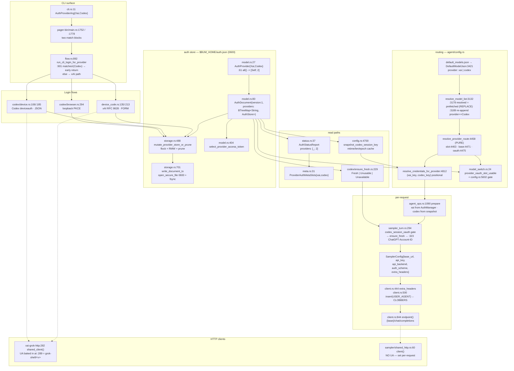

# bum / grok-build harness anatomy — what NeevCloud hooks into

Everything below was read out of the tree at `/home/cristian/bum/grok-build`. Paths are relative to
`crates/codegen/` unless stated. See [01-protocol-reference.md](01-protocol-reference.md) for the verified NeevCloud wire
contract and [03-port-plan.md](03-port-plan.md) for the edit list.

---

## 0. The crate-name trap, first

`xai-grok-auth` is **not** the auth crate. It is 411 lines across 4 files:

```
xai-grok-auth/src/auth_provider.rs     118
xai-grok-auth/src/lib.rs                14
xai-grok-auth/src/retry_middleware.rs  272
xai-grok-auth/src/visibility.rs          7
```

Its entire public surface:

| symbol | file:line |
|---|---|
| `trait HttpAuth: Send + Sync` — `fn apply(&self, RequestBuilder, base_url) -> RequestBuilder` | `xai-grok-auth/src/visibility.rs:5` |
| `struct CredentialSnapshot { token, user_id, team_id, organization_id }` | `xai-grok-auth/src/auth_provider.rs:14` |
| `trait AuthCredentialProvider: HttpAuth` | `xai-grok-auth/src/auth_provider.rs:39` |
| `struct StaticAuthCredentialProvider` | `xai-grok-auth/src/auth_provider.rs:78` |

Zero OAuth, zero device-code, zero token exchange. It is a dependency-inversion seam so
`xai-file-utils` can do authenticated HTTP without importing shell types. **NeevCloud does not touch
this crate.**

All auth lives in **`xai-grok-shell/src/auth/`** (~38 files, ~25k lines). Start there.

---

## 1. Product home + the auth file

`xai-grok-config/src/paths.rs:64`:

```rust
pub fn grok_home() -> PathBuf {
    GROK_HOME
        .get_or_init(|| {
            let home = resolve_product_home(std::env::var_os("BUM_HOME"), std::env::home_dir());
            let _ = std::fs::create_dir_all(&home);
            home
        })
        .clone()
}
```

`$BUM_HOME` else `~/.bum`. `OnceLock` — **you cannot re-point `BUM_HOME` between tests in one
process**, which is why every auth API takes an explicit `auth_file: &Path` and every entry point has
a `*_at` variant. There is no canonical `fn auth_file_path()`; ~6 call sites compose
`grok_home().join("auth.json")` by hand (`auth/codex/ensure_fresh.rs:204`,
`agent/config.rs:4714`, `agent/handlers/model_switch.rs:25`, `auth/flow.rs:907`, …).

---

## 2. The auth store — already multi-slot, already 0600

### On-disk shape

`auth/model.rs:73-85`:

```rust
pub const AUTH_DOCUMENT_VERSION: u32 = 1;

#[derive(Debug, Clone, Serialize, Deserialize, Default)]
pub(crate) struct AuthDocument {
    #[serde(default, skip_serializing_if = "Option::is_none")]
    pub version: Option<u32>,
    #[serde(default)]
    pub providers: BTreeMap<String, AuthStore>,
}
```

`pub type AuthStore = BTreeMap<String, GrokAuth>;` (`auth/model.rs:306`) — a **scope-key → credential**
map per slot. On disk:

```json
{"version":1,"providers":{
  "xai":   {"<scope>": {…GrokAuth}},
  "codex": {"https://auth.openai.com::app_EMoamEEZ73f0CkXaXp7hrann": {…GrokAuth}}
}}
```

`providers` is an open `BTreeMap<String, _>`. **A third slot needs zero schema change and no version
bump.** Bumping `AUTH_DOCUMENT_VERSION` to 2 would make every older bum binary hard-fail
(`ErrorKind::Unsupported`) on the *whole* file and lose the xai + codex logins with it.

### Slot identity

`auth/model.rs:17-63` — the keystone:

```rust
pub const PROVIDER_XAI: &str = "xai";
pub const PROVIDER_CODEX: &str = "codex";

pub enum AuthProvider { Xai, Codex }

impl AuthProvider {
    pub fn as_str(self) -> &'static str { /* :36 */ }
    pub fn label(self) -> &'static str  { /* :44 — "xAI" / "Codex" */ }
    pub fn parse(s: &str) -> Option<Self> { /* :52 — fails closed on unknown */ }
    pub fn all() -> [Self; 2] { [Self::Xai, Self::Codex] }   // :61  ← [Self; 3]
}
```

`parse` fails closed, so an unknown wire string can never create an arbitrary map key.

### `GrokAuth` — the credential record

`auth/model.rs:121-176`. Fields NeevCloud will use, verbatim from the file:

| field | line | NeevCloud mapping |
|---|---|---|
| `key: String` | 122 | `access_token` (== `apiKey`, per protocol gotcha #2) |
| `auth_mode: AuthMode` | 123 | `AuthMode::Oidc` |
| `create_time: DateTime<Utc>` | 124 | `Utc::now()` |
| `user_id: String` | 125 | `/api/user` → `id` (`acc_01…`) |
| `email: Option<String>` | 126 | `/api/user` → `email` |
| `organization_id: Option<String>` | 144 | `/api/orgs[0].id` (`wrk_01…`) — the `x-org-id` value |
| `organization_name: Option<String>` | 146 | `/api/orgs[0].name` / `workspaceName` |
| `refresh_token: Option<String>` | 162 | same bytes as `key` — **must be set anyway**, see §2.4 |
| `expires_at: Option<DateTime<Utc>>` | 167 | `now + expires_in` (~1 year) |
| `oidc_issuer: Option<String>` | 171 | resolved console URL |
| `oidc_client_id: Option<String>` | 175 | `"neev-cli"` |

There is **no `plan` field** on `GrokAuth`. `ProviderAuthStatus.plan` (`auth/status.rs:32`) is derived
and renders an em-dash for `None`.

`Debug` is hand-written (`auth/model.rs:178-191`) and only prints `token_suffix(&self.key)` — last 12
chars (`auth/model.rs:354`). Keep any new type equally paste-safe.

### Selection + expiry

`select_provider_access_token(&AuthStore)` (`auth/model.rs:404`) is the only sanctioned way to pick a
credential from a slot map — never `BTreeMap` first/arbitrary:

1. skip `AuthMode::WebLogin`, skip blank keys
2. prefer non-expired when any fresh exists
3. rank `Oidc(0) > ApiKey(1) > External(2)` (`provider_token_mode_rank`, `auth/model.rs:384`)
4. tie-break on **lexicographically smaller scope** — a `dev.code.neevcloud.com::neev-cli` scope
   would sort ahead of prod

Expiry math (`auth/model.rs:437-452`):

```rust
pub(crate) fn is_expired(auth: &GrokAuth) -> bool {
    is_expired_with_buffer(auth, early_invalidation())
}
pub(crate) fn is_expired_with_buffer(auth: &GrokAuth, buffer: Duration) -> bool {
    if let Some(expires_at) = auth.expires_at {
        Utc::now() >= (expires_at - buffer)
    } else {
        Utc::now().signed_duration_since(auth.create_time) >= (TOKEN_TTL - buffer)
    }
}
```

`early_invalidation()` (`auth/model.rs:429`) = `GROK_AUTH_EARLY_INVALIDATION_SECS` else
`DEFAULT_EARLY_INVALIDATION_SECS = 300` (`auth/model.rs:8`). **That is neev's 5-minute early-refresh
window already.** Add no constant.

`AuthMode` (`auth/model.rs:93-104`) — note `is_session_auth()` at `:108` is `true` for
`WebLogin | Oidc`, `false` for `External | ApiKey`. That flag gates `supported_in_api: false` models.

### 2.4 The `Oidc`-without-refresh_token trap

`auth/token_type.rs:23-29`: `AuthMode::Oidc` **without** a `refresh_token` degrades to the
unrefreshable `LegacySession`. And `credential_usable` (`auth/status.rs:121`):

```rust
pub fn credential_usable(auth: &GrokAuth) -> bool {
    if auth.key.trim().is_empty()
        && auth.refresh_token.as_ref().is_none_or(|t| t.trim().is_empty()) { return false; }
    let hard_unexpired =
        !auth.key.trim().is_empty() && !is_expired_with_buffer(auth, Duration::zero());
    if hard_unexpired { return true; }
    // Refreshable OAuth session: nonblank refresh_token present.
    …
}
```

Since NeevCloud's access and refresh tokens are byte-identical it is tempting to store only `key`.
Don't — store the same string in both fields.

### Mutation API — already provider-generic

`auth/storage.rs:488`:

```rust
pub fn mutate_provider_store_or_prune<F>(auth_file: &Path, provider: AuthProvider, f: F)
    -> std::io::Result<ProviderStoreMutation>
where F: FnOnce(&mut AuthStore)
{
    let lock = crate::auth::manager::lock::lock_auth_file_blocking(auth_file)?;
    mutate_provider_store_or_prune_with_lock(auth_file, &lock, provider, f)
}
```

The `_with_lock` body (`auth/storage.rs:505-534`) removes the slot key, applies `f`, re-inserts only
if non-empty, `retain(|_, s| !s.is_empty())`, stamps `version = Some(AUTH_DOCUMENT_VERSION)`, then
`persist_document_or_prune` — which **deletes `auth.json` when every slot goes empty**
(`ProviderStoreMutation::FileDeleted`). Codex explicitly rejects `FileDeleted` after a persist
(`auth/codex/browser.rs:205-212`); copy that guard.

Siblings:

| fn | file:line | note |
|---|---|---|
| `read_provider_auth_store(path, &str) -> Result<Option<AuthStore>, AuthStoreReadError>` | `auth/storage.rs:206` | missing file/slot = `Ok(None)`; parse/version/IO = redacted `Err`, callers fail closed |
| `clear_provider_slot(path, AuthProvider)` | `auth/storage.rs:538` | |
| `clear_all_provider_slots(path)` | `auth/storage.rs:562` | loops `AuthProvider::all()` at `:570` — generalizes free |
| `mutate_xai_store_or_prune` | `auth/storage.rs:587` | **xAI-only. Never call for a new provider.** |

### 0600 is free

`auth/storage.rs:701`:

```rust
fn write_document_to(path: &Path, doc: &AuthDocument) -> std::io::Result<()> {
    use crate::util::secure_file::open_secure_file;
    if let Some(parent) = path.parent() { std::fs::create_dir_all(parent)?; }
    let file = open_secure_file(path)?;
    let mut writer = std::io::BufWriter::new(file);
    serde_json::to_writer_pretty(&mut writer, doc)…;
    writer.flush()?;
    writer.into_inner()….sync_all()?;
    …
}
```

`open_secure_file` (`xai-grok-shell-base/src/util/secure_file.rs:72`) does
`OpenOptions::mode(0o600)` on Unix + ACL on Windows. Every write path — atomic tmp+rename
(`:725`), the storage-full in-place fallback, and the byte-rollback (`restore_prior_bytes`, `:781`) —
goes through it. Asserted at `auth/storage.rs:934` and `:1024`. neev's world-readable 0644 SQLite is
not reproducible here *provided you never open `auth.json` yourself*.

### Locking + corruption

Exclusive advisory flock on `auth.json.lock` (`auth/manager/lock.rs:363`). `AuthFileLock::still_live`
(`auth/storage.rs:52`) compares fd inode/dev against the on-disk lock path; every mutator revalidates
before read **and** immediately before persist, else `ErrorKind::WouldBlock`. Reason: a waiter can
break a stale lock by unlinking it, and a double-spent refresh token trips family revocation.

Corrupt file → `preserve_sibling_providers_from_corrupt` (`auth/storage.rs:391`) salvages any
still-parseable `providers.*` maps from the raw JSON before `backup_corrupt_auth_file` (`:284`)
renames to `auth.json.corrupt.<millis>`. That salvage is what stops an xAI-only write from nuking a
live sibling slot.

Legacy migration is read-side only (`parse_auth_document_str`, `auth/storage.rs:105`): a root object
**with** a `providers` key → typed `AuthDocument`; anything else → flat scope map wrapped in-memory as
`providers.xai` (`:133-141`), written back nested on the next mutation.

---

## 3. The two device-code flows that exist today

### 3.1 xAI — real RFC 8628, form-encoded (`auth/device_code.rs`, 927 lines)

Constants (`:19-22`):

```rust
const DEVICE_GRANT_TYPE: &str = "urn:ietf:params:oauth:grant-type:device_code";
const DEFAULT_DEVICE_POLL_INTERVAL_SECS: i32 = 5;
const DEVICE_SLOW_DOWN_INCREMENT_SECS: u64 = 5;
const MIN_DEVICE_CODE_EXPIRY_FALLBACK_SECS: i64 = 10 * 60;
```

`DEVICE_GRANT_TYPE` is the identical literal NeevCloud needs — reuse, don't redeclare.

Phase 1 — `request_device_code(issuer, client_id, scopes, surface)` (`:135`) POSTs **form** to
`{issuer}/oauth2/device/code`, maps HTTP 404 → `DeviceCodeError::NotEnabled` (`:166`), charset-validates
`user_code` to `[A-Za-z0-9-]` (`:174-184`), then `validate_verification_uri` (`:521`) on both
`verification_uri` and `verification_uri_complete`.

Phase 2 — `complete_device_code_login(...)` (`:213`). The poll loop (`:230-288`) is the more rigorous
of the two in-tree flows:

```rust
loop {
    // Sleep first: an immediate poll on a fresh code only returns
    // authorization_pending (and risks slow_down).
    tokio::time::sleep(poll_interval).await;
    if tokio::time::Instant::now() > deadline {
        anyhow::bail!("Device code expired. Run `grok login --device-auth` again.");
    }
    …
    match err.error.as_str() {
        "authorization_pending" => continue,
        "slow_down" => { poll_interval += Duration::from_secs(DEVICE_SLOW_DOWN_INCREMENT_SECS); continue }
        "access_denied"  => anyhow::bail!("Authorization denied. The user rejected the request."),
        "expired_token"  => anyhow::bail!("Device code expired. Run `grok login --device-auth` again."),
        other => anyhow::bail!("Token exchange error: {detail}"),
    }
}
```

Deadline = `expires_in.max(MIN_DEVICE_CODE_EXPIRY_FALLBACK_SECS)` (`:223-228`).
`build_auth` (`:422`) constructs the `GrokAuth` and persists via `auth_manager.update(auth)`.

`DeviceCodeError` (`:25`) has exactly two variants: `NotEnabled` and `Other(#[from] anyhow::Error)`.

**`validate_verification_uri` (`:521`) `url::Url::parse`s and demands https (or loopback http).**
NeevCloud returns `verification_uri_complete` as a bare **path** — concatenate onto the base first,
then validate. Do not delete the guard.

### 3.2 Codex — proprietary deviceauth, **JSON bodies** (`auth/codex/device.rs`, 306 lines)

This is the closest structural template for NeevCloud (JSON, not form; non-discovery fixed paths).
Module doc (`:1-7`) states the wire contract explicitly — mirror that habit.

```rust
const DEFAULT_POLL_INTERVAL_SECS: u64 = 5;   // :19
const SLOW_DOWN_INCREMENT_SECS: u64 = 5;     // :20
const MAX_WAIT: Duration = Duration::from_secs(15 * 60);  // :21

pub fn codex_device_usercode_url(issuer: &str) -> String {   // :24
    format!("{}/api/accounts/deviceauth/usercode", issuer.trim_end_matches('/'))
}
pub fn codex_device_verify_url(issuer: &str) -> String {     // :40
    format!("{}/codex/device", issuer.trim_end_matches('/'))
}
```

`codex_device_verify_url` builds an **absolute** URL from the issuer — a structural copy-paste for
NeevCloud prints a broken link.

The request idiom (`:106-130`) is the one to mirror exactly:

```rust
let resp = crate::http::shared_client()
    .post(&url)
    .header("Content-Type", "application/json")
    .json(&body)
    .timeout(Duration::from_secs(30))
    .send()
    .await
    .map_err(|e| CodexLoginError::Other(format!("device usercode request failed: {e}")))?;

if resp.status().as_u16() == 404 {
    return Err(CodexLoginError::Other(
        "device code login is not enabled for this Codex server. …".into()));
}
```

Other load-bearing details: `parse_interval` (`:93`) tolerates the interval arriving as number *or*
string; `poll_for_authorization_code` (`:185`) sleeps first (`:200`) and treats **403/404 as pending**
(`:249`); `:252` carries `// Do not include body (may leak tokens)`;
`complete_codex_device_login` (`:164`) persists only **after** a successful exchange (`:180`).
Injectable-base test seams: `run_codex_device_login_with_base` (`:269`),
`run_codex_device_poll_only_with_base` (`:299`).

### 3.3 The Codex module barrel — copy this file shape

`auth/codex/mod.rs` in full is 77 lines. The parts that matter:

```rust
//! ChatGPT / Codex OAuth (browser PKCE + device-code) for the `providers.codex` slot.
//! …
//! Never imports `~/.codex`. Never writes the xAI slot. …

mod browser; mod claims; mod device; mod ensure_fresh; mod refresh;   // :12-16

pub const CODEX_ISSUER:    &str = "https://auth.openai.com";                  // :50
pub const CODEX_CLIENT_ID: &str = "app_EMoamEEZ73f0CkXaXp7hrann";             // :52
pub const CODEX_AUTH_SCOPE: &str =
    "https://auth.openai.com::app_EMoamEEZ73f0CkXaXp7hrann";                  // :54  {issuer}::{client_id}
pub const CODEX_ORIGINATOR: &str = "bum";                                     // :60

pub async fn run_codex_login(auth_file: &Path, force_device: bool)            // :68
    -> Result<GrokAuth, CodexLoginError>
{
    if force_device { run_codex_device_login(auth_file).await }
    else            { run_codex_browser_login(auth_file).await }
}
```

Test hooks are gated with `#[cfg(any(test, feature = "unstable", debug_assertions))]` (`:34-39`) —
the blessed pattern; no new feature flag.

### 3.4 `ensure_fresh` — the per-request freshness gate

`auth/codex/ensure_fresh.rs`. The ternary at `:44` is deliberate (CR-02):

```rust
/// Distinguishes permanent unusable credentials from transient availability
/// failures so reconstruct can keep a still-valid prepared SessionToken on
/// lock/IO/timeout instead of wiping it as if the user were logged out.
pub enum EnsureFreshCodexResult {
    Fresh(CodexAuthMaterial),   // safe to put on the wire
    Unusable,                   // hard-expired / missing slot / permanent IdP clear
    Unavailable,                // lock/IO/timeout — keep prepared key; NOT a logout
}
```

`CodexAuthMaterial` (`:24-36`) is the precedent for reusing `organization_id` as a header value:

```rust
pub struct CodexAuthMaterial { pub bearer: String, pub account_id: Option<String> }

impl CodexAuthMaterial {
    pub fn from_auth(auth: &GrokAuth) -> Self {
        Self { bearer: auth.key.clone(), account_id: auth.organization_id.clone() }
    }
}
```

The chain (`:224-300`): in-process `AsyncMutex` single-flight (`refresh_mutex()`, `:198`) →
`resolve_auth_file(explicit > test hook > product home)` (`:208`) → timed async flock via
`try_lock_auth_file_async(auth_file, AUTH_LOCK_TIMEOUT)` — `None` ⇒ `Unavailable` (`:271`) →
`still_live` recheck (`:275`) → `read_provider_auth_store(auth_file, PROVIDER_CODEX)` where
`Ok(None) ⇒ Unusable`, `Err ⇒ Unavailable` (`:280-290`) → `select_provider_access_token`, and
`auth_mode != Oidc ⇒ Unusable` (`:298`).

Entry points: `ensure_fresh_codex_auth()` (`:223`) and the path-taking
`ensure_fresh_codex_auth_at(auth_file, EnsureFreshCodexOptions { token_url_override })` (`:229`, opts
at `:77`).

### 3.5 Refresh — and why `build_refresher` is a decoy

`auth/refresh/mod.rs:139` defines the provider-agnostic seam:

```rust
#[async_trait::async_trait]
pub(crate) trait TokenRefresher: Send + Sync {
    /// MUST NOT mutate the auth manager. (contract at :141-144)
    async fn refresh(&self, reason: RefreshReason) -> RefreshOutcome;   // :145
}
pub(crate) enum RefreshOutcome {                                        // :91
    Success(Box<GrokAuth>),
    PermanentFailure { error: …, tried_key: … },
    TransientFailure { message: String },
}
```

`build_refresher` (`auth/refresh/mod.rs:148`) dispatches on `auth_provider_command: Option<String>`
and only ever yields `OidcRefresher | ExternalBinaryRefresher`. **`CodexRefresher`
(`auth/refresh/codex_refresher.rs:15`, 101 lines) is never routed through it** — it is constructed
out-of-band inside `ensure_fresh_codex_auth`, which owns the lock + persist + permanent-fail clear.
`with_token_url` (`codex_refresher.rs:30`) is the mock-IdP seam. Copy that arrangement; wiring a
third provider into `build_refresher` would drag the xAI refresh path into the blast radius for
nothing.

Pure exchange lives in `auth/codex/refresh.rs`: `CodexRefreshResult` (`:15`), `classify_terminal`
(`:25` — `invalid_grant` → RefreshTokenRejected, `invalid_client` → ClientRejected),
`codex_token_url` (`:34`), identity-preserving `merge_codex_refresh_response` (`:46`),
`codex_token_exchange` (`:85`).

---

## 4. Status / meta / CLI surface

### `auth/status.rs` — hard arity 2

```rust
pub struct ProviderAuthStatus {          // :19
    pub provider: AuthProvider,
    pub logged_in: bool,
    pub usable: bool,
    pub account: Option<String>,
    pub plan: Option<String>,
}

/// Dual-provider status report (always both slots, xAI then Codex).
pub struct AuthStatusReport { pub providers: [ProviderAuthStatus; 2] }   // :37
```

`from_document` (`:75`) and `empty()` (`:91`) build that array with two positional literals.
`format_auth_status` (`:234`) **iterates** `report.providers` — the renderer generalizes for free;
only the container type is the blocker. `from_auth_file` (`:47`) maps `NotFound → empty()`,
`InvalidData → AuthStoreReadError::Parse`, `Unsupported → UnsupportedVersion`. The paste-safe
contract is a test (`format_never_emits_token_material`, `auth/status.rs:305`).

Also here: `credential_usable` (`:121`, quoted in §2.4), `provider_slot_usable` (`:155`),
`inspect_provider_store` (`:109`).

### `auth/meta.rs` — named fields, not a map

```rust
pub struct ProviderAuthMetaSlots {                       // :31
    #[serde(default)] pub xai: ProviderSlotUsableMeta,
    #[serde(default)] pub codex: ProviderSlotUsableMeta,
}

impl ProviderAuthMetaSlots {
    pub fn from_report(report: &AuthStatusReport) -> Self {   // :40
        let mut slots = Self::default();
        for status in &report.providers {
            match status.provider {                          // :43-50 — exhaustive
                AuthProvider::Xai   => slots.xai.usable   = status.usable,
                AuthProvider::Codex => slots.codex.usable = status.usable,
            }
        }
        slots
    }
}
```

That `match` is exhaustive over `AuthProvider` — adding a variant **fails to compile here**, which is
the good kind of break. `#[serde(default)]` on a new field keeps older ACP clients deserializing
(regression test at `auth/meta.rs:175`).

### `auth/flow.rs` — the highest-risk generalization site

`run_cli_login_for_provider` (`:892`), verbatim:

```rust
    // Codex path: complete Codex login and return BEFORE any xAI post_login_sync
    // (T-05-22 — never feed a Codex principal into xAI team managed-config).
    if matches!(provider, Some(super::AuthProvider::Codex)) {       // :901
        if devbox {
            anyhow::bail!("Devbox login is not available for Codex. Use `bum login --provider codex`.");
        }
        let auth_file = grok_home::grok_home().join("auth.json");
        let force_device = device_auth && !oauth;
        let auth = super::codex::run_codex_login(&auth_file, force_device)
            .await
            .map_err(|e| anyhow::anyhow!("{e}"))?;
        report_signed_in_for_provider(&auth, Some(super::AuthProvider::Codex));
        return Ok(());
    }
    // …everything below is the xAI path
```

This is a **two-way test that falls through to xAI for any third variant** and compiles cleanly. Same
shape at `:950`, `:1077`, `:1085`, `:1251`, `:1266`, and in `extensions/auth.rs:163`.

`report_signed_in_for_provider` (`:778`):

```rust
fn report_signed_in_for_provider(auth: &GrokAuth, provider: Option<super::AuthProvider>) {
    eprint!("\r\x1b[K");
    let label = match provider {
        Some(super::AuthProvider::Codex) => Some("Codex"),
        Some(super::AuthProvider::Xai)   => Some("xAI"),
        None => None,
    };
    …
}
```

That one *is* exhaustive over `Some(_)` — the compiler will catch it.

Bare `bum logout` is intentionally fail-closed (Err + usage, zero mutation, `:1234-1238`) so a slot
can never be silently wiped. `--all` → `logout_all_provider_slots` (`:1093`) → `clear_all_provider_slots`
→ `AuthProvider::all()`.

### Clap surface — there is no `bum auth login`

`xai-grok-pager/src/app/cli.rs:8-24`:

```rust
/// Dual-auth provider wire ids for `login` / `logout --provider` (D-01 / D-05).
/// Stable short ids match multi-slot store keys (`providers.xai` / `providers.codex`).
#[derive(Debug, Clone, Copy, PartialEq, Eq, ValueEnum)]
pub enum AuthProviderArg {
    /// xAI / Grok OAuth (default for bare `bum login`)
    Xai,
    /// ChatGPT / Codex OAuth
    Codex,
}

/// Subcommands under `bum auth` (D-06).
#[derive(Debug, Clone, Subcommand)]
pub enum AuthCommand {
    /// Show login/usable status for both providers (never prints secrets).
    Status,
}
```

The real surface is `bum login --provider xai|codex`, `bum logout --provider <id> | --all`,
`bum auth status`. `AuthCommand` has exactly one variant. **No `#[value(name=…)]` overrides exist** —
clap's ValueEnum derive kebab-cases variant names, and `Xai`/`Codex` work by luck. A variant spelled
`NeevCloud` silently becomes `--provider neev-cloud`.

Dispatch: `xai-grok-pager-bin/src/main.rs:1752-1760` (login) and `:1778-1785` (logout) are two
separate, near-identical, wildcard-free `match p` blocks — both fail to compile on a new variant.
`Command::Auth { Status }` at `:1790-1802` reads `grok_home().join("auth.json")`.

The device prompt is **not a TUI component**: `auth/codex/device.rs:274-292` renders it with bare
`eprintln!` to stderr and best-effort `webbrowser::open`. `AuthUrlMode::Device` / `AuthUrlInfo` /
`AuthChannels` (`auth/flow.rs:167-202`) exist but have **zero** consumers under
`xai-grok-pager/src/` — they are xAI/OIDC/ACP-only. Codex deliberately does not use them.

---

## 5. Routing — model id → base URL + credential slot

All of it lives in `xai-grok-shell/src/agent/config.rs` (~12,150 lines). There is **no `Provider`
trait anywhere in the workspace.**

### Two parallel enums, no type link

`agent/config.rs:3394-3418`:

```rust
pub enum ModelProvider {
    /// xAI / Grok models (default when `provider` is omitted).
    #[default] Xai,
    /// Codex / ChatGPT models.
    Codex,
}
impl ModelProvider {
    /// Public wire id (`"xai"` / `"codex"`), matching auth slot ids.
    pub fn as_str(self) -> &'static str { match self { Self::Xai => "xai", Self::Codex => "codex" } }
    pub fn display_label(self) -> &'static str { … }   // :3412
}
```

`ModelProvider` (routing) and `AuthProvider` (storage) are separate enums whose `as_str()` values
**must be byte-equal by convention, not by the type system**. `resolve_provider_route` bridges them by
returning a `&'static str`. Get the string wrong and routing looks fine while
`read_provider_auth_store` returns `Ok(None)` → the gate rejects the model with "no usable
credentials" and nothing logs why.

Note `#[default] Xai` + `#[serde(default)]`: a row that *omits* `provider` silently becomes an xAI
model.

### Endpoints

```rust
pub const XAI_API_BASE_URL_DEFAULT: &str = "https://api.x.ai/v1";                    // :48
pub const CODEX_BASE_URL_DEFAULT:   &str = "https://chatgpt.com/backend-api/codex";  // :53
```

`EndpointsConfig` (`:148`) field (`:162`):

```rust
    /// Base URL for the ChatGPT / Codex backend used by `provider=codex` models.
    /// Env: `GROK_CODEX_BASE_URL`. Blank/whitespace falls back to
    /// [`CODEX_BASE_URL_DEFAULT`] via [`Self::resolve_codex_base_url`].
    pub codex_base_url: String,
```

Resolver (`:331`) and env wiring (`:569`):

```rust
pub fn resolve_codex_base_url(&self) -> String {
    if self.codex_base_url.trim().is_empty() { CODEX_BASE_URL_DEFAULT.to_owned() }
    else { self.codex_base_url.clone() }
}
// impl Default for EndpointsConfig:
codex_base_url: std::env::var("GROK_CODEX_BASE_URL")
    .unwrap_or_else(|_| CODEX_BASE_URL_DEFAULT.to_owned()),
```

**This is the const+env triple NeevCloud cannot copy directly** — its inference base is fetched at
runtime from `/api/config`.

### The route authority

`agent/config.rs:4425-4485`:

```rust
pub struct ProviderRoute {
    pub base_url: String,
    /// Auth slot wire id (`"xai"` / `"codex"`) — follows [`ModelProvider`], not host.
    pub credential_slot: &'static str,
    pub provider: ModelProvider,
    /// When `false`, production credential resolve must not attach provider
    /// session OAuth bearer to this host …
    pub session_oauth_allowed: bool,
}

/// # Production authority
/// This is the single authority for default base URL selection by
/// [`ModelProvider`]. … **must** use this function — do not re-implement parallel if/else
/// base tables.
pub fn resolve_provider_route(
    provider: ModelProvider,
    endpoints: &EndpointsConfig,
    model_base_url_override: Option<&str>,
) -> ProviderRoute {
    let credential_slot = match provider {                                  // :4463
        ModelProvider::Xai   => crate::auth::PROVIDER_XAI,
        ModelProvider::Codex => crate::auth::PROVIDER_CODEX,
    };
    let base_url = model_base_url_override
        .map(str::trim).filter(|s| !s.is_empty()).map(str::to_owned)
        .unwrap_or_else(|| match provider {                                 // :4471
            ModelProvider::Xai   => endpoints.resolve_inference_base_url(),
            ModelProvider::Codex => endpoints.resolve_codex_base_url(),
        });
    let session_oauth_allowed = match provider {                            // :4475
        ModelProvider::Xai   => crate::util::is_first_party_xai_url(&base_url),
        ModelProvider::Codex => is_first_party_codex_url(&base_url, endpoints),
    };
    ProviderRoute { base_url, credential_slot, provider, session_oauth_allowed }
}
```

Three exhaustive matches — the compiler enumerates them for you. **The function is documented as pure
and sync.** It cannot do the async `/api/config` fetch NeevCloud needs; `model_base_url_override` is
the sanctioned injection channel.

Host trust (`:4499`):

```rust
pub fn is_first_party_codex_url(url: &str, endpoints: &EndpointsConfig) -> bool {
    let Ok(parsed) = reqwest::Url::parse(url) else { return false };
    let Some(host) = parsed.host_str() else { return false };
    let host_l = host.to_ascii_lowercase();
    if (host_l == "chatgpt.com" || host_l == "www.chatgpt.com")
        && parsed.path().starts_with("/backend-api/codex") { return true }
    if let Ok(configured) = reqwest::Url::parse(&endpoints.resolve_codex_base_url())
        && let Some(cfg_host) = configured.host_str()
        && host.eq_ignore_ascii_case(cfg_host)
    {
        let cfg_path = configured.path().trim_end_matches('/');
        // Empty or root configured path: host match is enough … Non-empty path: require prefix alignment.
        if cfg_path.is_empty() || cfg_path == "/" || parsed.path().starts_with(cfg_path) { return true }
    }
    false
}
```

Host-only matching is explicitly insufficient — the path prefix is part of the check. A NeevCloud
analog must accept `code.neevcloud.com` **and** the `/zen/go/v1` prefix; note NeevCloud is the awkward
case where console and gateway share a host.

### Credential attach — positional 2-tuples all the way down

`agent/config.rs:4812`:

```rust
pub fn resolve_credentials_for_provider(
    model: &ModelEntry,
    endpoints: &EndpointsConfig,
    xai_session_key: Option<&str>,
    codex_session_key: Option<&str>,
) -> ResolvedCredentials {
    let route = resolve_provider_route(provider, endpoints, Some(info.base_url.as_str()));
    let request_base = route.base_url.clone();

    let (api_key, base_url, auth_type) = if let Some(key) = model.own_credential() {
        (Some(key), request_base, AuthType::ApiKey)                  // BYOK wins
    } else if route.session_oauth_allowed {
        let slot_key = match provider {                              // :4834
            ModelProvider::Xai   => non_blank_session_key(xai_session_key),
            ModelProvider::Codex => non_blank_session_key(codex_session_key),
        };
        if let Some(key) = slot_key { (Some(key.to_owned()), request_base, AuthType::SessionToken) }
        else if provider == ModelProvider::Xai { /* XAI_API_KEY env fallback */ }
        else {
            // Codex: never fall through to XAI_API_KEY (D-15).
            warn_missing_env_key(model);
            (None, request_base, AuthType::ApiKey)
        }
    } else if provider == ModelProvider::Xai { /* custom host + XAI_API_KEY */ }
    else {
        // Codex custom host without own credential: no session OAuth, no XAI env.
        warn_missing_env_key(model);
        (None, request_base, AuthType::ApiKey)
    };
    …
}
```

The `provider == ModelProvider::Xai` guards mean a third provider correctly lands in the fail-closed
`else` branches — no `XAI_API_KEY` leak. Wrappers, all positional `(xai, codex)`:

| fn | line |
|---|---|
| `resolve_credentials(model, session_key)` — splits one key by provider at `:4549` | `:4546` |
| `session_key_for_model_provider(provider, xai, codex)` | `:4564` |
| `prepare_sampling_credentials(model, endpoints, xai_session_key, codex_session_key)` | `:4579` |
| `try_resolve_model_credentials` | `:4966` |

Callers: `agent/models.rs:959`, `agent/subagent/mod.rs:1033`, `agent/mvp_agent/agent_ops.rs:1115`.

### Prepare — where the slot keys are actually sourced

`agent/mvp_agent/agent_ops.rs:1090`:

```rust
pub(crate) fn prepare_prepared_sampling_config_for_model(&self, model: &ModelEntry, …)
    -> crate::agent::config::PreparedSamplingConfig
{
    let preferred = self.cfg.borrow().grok_com_config.preferred_method;
    // xAI AuthManager key — dual-key xAI slot only (never as Codex session).
    let xai_session = match preferred { … };
    let xai_session_key = xai_session.as_ref().map(|a| a.key.as_str());
    // Codex: snapshot providers.codex once at prepare (D-09 / Phase 4 snapshot).
    // Blocking I/O is prepare/switch only — not per-stream reconstruct.
    let codex_session_owned = crate::agent::config::snapshot_codex_session_key_from_auth_store();
    let codex_session_key = codex_session_owned.as_deref();
    …
    let mut credentials = crate::agent::config::prepare_sampling_credentials(
        model, &endpoints, xai_session_key, codex_session_key);
    // Preferred Oidc … are xAI-principal preferences — do not rewrite Codex prepare
    // provenance to SessionToken when the Codex slot is empty …
    if matches!(preferred, Some(PreferredAuthMethod::Oidc))
        && model.info.provider == ModelProvider::Xai { … }
```

The Oidc-preference rewrite (`:1124`) and SessionToken override (`:1138`) are already guarded on
`provider == Xai`. Leave them.

The snapshot (`agent/config.rs:4700`) is an mtime/len/epoch-keyed cache over the disk store:

```rust
pub fn snapshot_codex_session_key_from_auth_store() -> Option<String> {
    struct Cache { path: PathBuf, modified: Option<SystemTime>, len: u64, epoch: u64, token: Option<String> }
    static CACHE: Mutex<Option<Cache>> = Mutex::new(None);
    let path = crate::util::grok_home::grok_home().join("auth.json");
    …
    let epoch = CODEX_SNAPSHOT_EPOCH.load(Ordering::SeqCst);
    if /* path && modified && len && epoch all match */ { return cached.token.clone() }
    let token = match crate::auth::read_provider_auth_store(&path, crate::auth::PROVIDER_CODEX) {
        Ok(Some(store)) => crate::auth::select_provider_access_token(&store).map(|a| a.key),
        Ok(None) => None,
        Err(e) => { tracing::warn!(error = %e,
            "codex auth store snapshot failed; fail-closed (no Codex session key)"); None }
    };
    …
}
pub fn invalidate_codex_session_key_snapshot() {                    // :4756
    CODEX_SNAPSHOT_EPOCH.fetch_add(1, Ordering::SeqCst);
}
static CODEX_SNAPSHOT_EPOCH: AtomicU64 = AtomicU64::new(0);         // :4760
```

The `epoch` exists because mtime+len can collide on a same-second write — a clone without a matching
`invalidate_*` after login means the first post-login model switch sees an empty slot.

`config.rs:4762-4772` re-exports the whole codex ensure_fresh surface into `agent::config` so the
session layer never imports `crate::auth::codex` directly.

### Per-request reconstruct — the last provider branch before HTTP

`session/acp_session_impl/sampler_turn.rs:288-330`:

```rust
        // AUTH-05: per-request Codex OAuth ensure_fresh on SessionToken + first-party host.
        // BYOK (ApiKey) and custom non-allowlisted hosts keep prepared creds.api_key;
        // never force OAuth bearer override or IdP spend on those routes.
        let endpoints = crate::agent::config::EndpointsConfig::from_effective_config();
        let mut api_key = creds.api_key;
        let mut codex_account_id: Option<String> = None;
        let codex_session_oauth = model_facts.provider == Some(ModelProvider::Codex)
            && creds.auth_type == xai_chat_state::AuthType::SessionToken
            && crate::agent::config::is_first_party_codex_url(&cfg.base_url, &endpoints);
        if codex_session_oauth {
            match crate::agent::config::ensure_fresh_codex_auth().await {
                EnsureFreshCodexResult::Fresh(material) => {
                    api_key = Some(material.bearer);
                    codex_account_id = material.account_id;
                }
                EnsureFreshCodexResult::Unusable => { api_key = None; }
                EnsureFreshCodexResult::Unavailable => { /* keep prepared SessionToken */ }
            }
        }
        let mut extra_headers = cfg.extra_headers;
        crate::agent::config::inject_url_derived_headers(&mut extra_headers, …, &cfg.base_url);
        // Trusted-host ChatGPT-Account-ID only (D-11) — same first-party gate as bearer.
        if codex_session_oauth {
            crate::agent::config::inject_chatgpt_account_id_header(
                &mut extra_headers, &cfg.base_url, &endpoints, codex_account_id.as_deref());
        }
```

`inject_chatgpt_account_id_header` (`agent/config.rs:4779`) is first-party-host-gated, no-ops on
`None`, and uses `.entry(…).or_insert_with(…)` so it never clobbers.

### The missing-provider gate

`agent/handlers/model_switch.rs:24`:

```rust
fn provider_oauth_slot_usable(agent: &MvpAgent, provider: config::ModelProvider) -> bool {
    let path = crate::util::grok_home::grok_home().join("auth.json");
    let slot = match provider {
        config::ModelProvider::Xai   => crate::auth::PROVIDER_XAI,
        config::ModelProvider::Codex => crate::auth::PROVIDER_CODEX,
    };
    let disk_usable = match crate::auth::read_provider_auth_store(&path, slot) {
        Ok(store) => crate::auth::provider_slot_usable(store.as_ref()),
        // Fail closed on parse / unsupported version (no credential disclosure).
        Err(_) => false,
    };
    if disk_usable { return true }
    if matches!(provider, config::ModelProvider::Xai) {          // :38 — xAI-only by design
        if let Some(auth) = agent.auth_manager.current_or_expired() {
            return crate::auth::credential_usable(&auth);
        }
    }
    false
}
```

The decision fn is already provider-generic (`agent/config.rs:5602`):

```rust
pub fn missing_provider_gate_error(
    provider: ModelProvider, model_id: &str,
    has_own_credentials: bool, slot_usable: bool,
) -> Option<ModelSwitchMissingProviderError> {
    if has_own_credentials || slot_usable { return None }
    Some(ModelSwitchMissingProviderError::new(provider, model_id))
}
```

Zero change needed — the suggestion string `format!("bum login --provider {id}")`
(`agent/config.rs:5557`) derives from `as_str()`. But `into_acp_error`'s `provider_label` (`:5563`)
and `user_message`'s (`:5587`) both have `_ =>` catch-alls that default to xAI.

---

## 6. The model catalog — two layers, two deserializers

### Layer 1: static, ID-only

`xai-grok-models/src/lib.rs:12` does `include_str!` on `default_models.json` and parses **only** the
`model` field per entry (`DefaultModelEntry`, `:26`). It exposes four ID getters: `default_model()`
(`:47`), `default_web_search_model()` (`:52`), `default_image_description_model()` (`:57`),
`default_session_summary_model()` (`:65`), and asserts `default ∈ models[]` (`:37-41`).

The whole catalog file today — 46 lines, 4 entries:

```json
{
  "default": "grok-build",
  "web_search": "grok-4.20-multi-agent",
  "models": [
    { "model": "grok-build",    "provider": "xai",   "context_window": 500000,
      "api_backend": "responses", "supported_in_api": false },
    { "model": "gpt-5.6-sol",   "provider": "codex", "context_window": 272000,
      "api_backend": "responses", "supported_in_api": true },
    { "model": "gpt-5.6-terra", "provider": "codex", … },
    { "model": "gpt-5.6-luna",  "provider": "codex", … }
  ]
}
```

(`xai-grok-models/default_models.json:1-46`. Note `web_search` points at `grok-4.20-multi-agent`,
which is not in `models[]` — only `default` is validated. Don't "fix" it.)

### Layer 2: the real catalog

`agent/config.rs` **re-parses the same `DEFAULT_MODELS_JSON`** through `DefaultModelJson`
(`:3421-3455`, `#[serde(default)]` at the struct level) for ~21 rich fields, then builds
`ModelEntryConfig` (`:3529`) → `ModelInfo` (`:3831`) → `ModelEntry { info, api_key, env_key,
api_base_url }` (`:4010`).

**Adding a field to `default_models.json` is a silent no-op unless you also add it to
`DefaultModelJson`** — the struct-level `#[serde(default)]` swallows unknown keys.

`default_model_entries(&endpoints)` (`:3358`) stamps each row's `info.base_url` from
`resolve_provider_route(m.provider, endpoints, None)` and `api_base_url` from a `match m.provider`
(`:3485-3488`, Xai ⇒ `Some(xai_api_base_url)`, Codex ⇒ `None`).

### The prefetch replace + re-append seam

`resolve_model_list(cfg, prefetched)` (`agent/config.rs:3132`) — the trap in full:

```rust
    if cfg.endpoints.has_custom_endpoint() { /* skip built-in defaults */ }
    else { resolved.extend(default_model_entries(&cfg.endpoints)); }     // :3144

    if let Some(mut prefetched) = prefetched {
        for (key, entry) in prefetched.iter_mut() { /* donor-inherit cw/agent_type/api_backend */ }
        resolved = prefetched;                                            // :3178 — REPLACE, not merge
        // Multi-provider survival: remote prefetch replaces the catalog …, then
        // re-append bundled Codex defaults so GPT-5.6 rows remain … Remove-then-append
        // (not replace-in-place) so colliding gpt-5.6-* keys land at the end … and
        // remote cannot rebind those ids to xai. Skip on enterprise custom models endpoints.
        if !cfg.endpoints.has_custom_endpoint() {
            let codex_defaults: Vec<_> = defaults.iter()
                .filter(|(_, entry)| entry.info.provider == ModelProvider::Codex)   // :3189
                .map(|(k, e)| (k.clone(), e.clone())).collect();
            for (key, _) in &codex_defaults { resolved.shift_remove(key); }
            for (key, entry) in codex_defaults { resolved.insert(key, entry); }
            // WR-02: empty/xAI-less prefetch must not leave only Codex rows — otherwise
            // resolve_default_model's first_or_fallback lands on gpt-5.6-sol. …
            let has_xai = resolved.values().any(|e| e.info.provider == ModelProvider::Xai);
            if !resolved.contains_key(default_id) && !has_xai { /* re-inject xAI at front */ }
        }
    }
```

Three things fall out of this:

1. `resolved = prefetched` is a **wholesale replace**. Anything not re-injected afterwards is gone.
2. The Codex re-append lives **inside** `if let Some(prefetched)`. Codex survives the no-prefetch path
   only because it is in `default_models()` at `:3144`. Rows sourced from anywhere else must be
   appended *after* the whole if-let block, or they are invisible to every
   `resolve_model_list(cfg, None)` caller (`cli_models.rs:40`, ~15 cases in
   `tests/model_catalog.rs`).
3. Order is semantic — `IndexMap`, not `HashMap`.
4. WR-02's `has_xai` logic was written when "not xAI" implied "Codex". A third provider changes what
   "first entry" means.

### The dynamic layer is single-endpoint by construction

`agent/models.rs`: `ModelFetchAuth::resolve` (`:39`) picks exactly **one** credential
(CustomEndpoint > Session > Deployment > ApiKey); `ListModelsEndpoint::from_endpoints`
(`remote/client.rs:687`) resolves exactly **one** URL; `ModelsCacheManager` (`models.rs:1255`) is one
file (`models_cache.json`, `:1215`) with `CACHE_TTL = 300s` (`:1216`) keyed by `auth_method` + `origin`
(`:1224-1237`). Foreign-origin cache is a deliberate MISS because entries embed absolute base URLs —
that comment records a real Windows e2e failure. There is **no per-provider fan-out**, and Codex never
prefetches.

### Picker consumption

`resolve_model_catalog` (`models.rs:1845`) → `disabled_models` (remove) → `allowed_models` (mark
`user_selectable`) → `hidden_models` (mark `hidden`), all globs (`ModelGlobSet`, `:1805`) matched
against key **or** model slug. `available_models` (`:1790`) filters on
`info.visible_for_auth(is_session_auth)` = `!self.hidden && (is_session_auth || self.supported_in_api)`
(`agent/config.rs:4003`). `to_acp_model_info` (`agent/config.rs:5408`) emits `meta.provider` from
`info.provider.as_str()` (`:5427-5432`, comment: "copied only from trusted in-process
ModelInfo.provider — never client input").

### Field gaps vs NeevCloud `/api/config`

| NeevCloud field | catalog home |
|---|---|
| `limit.context` | `context_window: NonZeroU64` (**required, non-zero**) |
| `limit.output` | `max_completion_tokens: Option<u32>` |
| `options.baseURL` | `base_url` / `model_base_url_override` |
| `options.apiKey` | `ModelEntry.api_key` **exists — do not use it**, see §8 |
| `models.<id>.name` | `name` |
| `cost.input` / `cost.output` | **NOT FOUND.** `grep -n "cost\|price\|per_token"` over `agent/config.rs` returns zero hits. No pricing concept exists. |
| `tool_call: true` | **NOT FOUND.** No per-model tool-capability flag. |
| `reasoning: true` | no equivalent. `supports_reasoning_effort` + `reasoning_efforts` describe the low/med/high **menu**, not "this model reasons". Not a 1:1 map. |

---

## 7. The HTTP + sampler layer

### Two independent client stacks

**Non-sampling (auth, console, model-list)** → `xai_grok_http` (aliased `use xai_grok_http as http`
inside the shell). `xai-grok-http/src/lib.rs:282`:

```rust
pub fn shared_client() -> reqwest::Client {
    static CLIENT: OnceLock<reqwest::Client> = OnceLock::new();
    CLIENT.get_or_init(|| {
        reqwest::Client::builder()
            .connect_timeout(Duration::from_secs(30))
            .user_agent(process_user_agent_string())        // :289
            .pool_idle_timeout(Duration::from_secs(30))
            .http2_keep_alive_interval(Duration::from_secs(20))
            .http2_keep_alive_timeout(Duration::from_secs(10))
            .http2_keep_alive_while_idle(true)
            .tcp_keepalive(Duration::from_secs(30))
            .build().expect("failed to build shared HTTP client")
    }).clone()
}
```

The doc comment above it (`:270-281`) is worth reading before you consider building a second client —
the health-checks exist specifically because "through an LB/Cloudflare/proxy a kept-alive connection
can be silently dropped upstream".

```rust
pub fn process_user_agent_string() -> String {              // :170
    …
    UserAgent { origin, agent_product: "grok-shell", agent_version, platform: PlatformInfo::current() }
        .render()                                            // :127
}
pub fn set_client_name(client_type: ClientType) {           // :164
    CLIENT_TYPE.set(client_type).expect("set_client_name called more than once");
}
```

Renders `grok-shell/<ver> (linux; x86_64)` — fine as-is for NeevCloud. Measured against
`code.neevcloud.com/api/orgs` (authenticated): curl with no `-A` (default `curl/8.x`) → 200,
`neev/latest/0.0.2/cli` → 200, an empty UA → 200, `Python-urllib/3.13` → **403 `error_code 1010
browser_signature_banned`**. Cloudflare bans a small set of known-bot signatures, not "unknown" UAs;
a `reqwest` client never sends one, so no UA work is *required* (see
[01-protocol-reference.md](01-protocol-reference.md) § 2).

**But the port pins one anyway, by decision.** `grok-shell/<ver>` is rejected for *fidelity*, not
function: [07-wire-fidelity.md](07-wire-fidelity.md) adopts presenting as the neev CLI on the wire, so
console calls carry `neev/latest/0.0.2/cli` and gateway calls carry identity B. Requirement and policy
are separate questions — nothing is enforced, and we match it regardless. 07 owns the spec.

The mechanism: `set_client_name` is process-global and `expect`s on a second call, so it **cannot**
carry a per-provider UA (it would rewrite xAI and Codex traffic too). Per-request
`.header(USER_AGENT, …)` on the `RequestBuilder` overrides the client-level default and is the only
correct route.

Also here: `with_auth_retry` (`:302`), `TransportFailure::classify` (`:400`, checks `is_connect()`
first), `send_with_retry_escaping_pool` (`:432`, takes an `is_retryable` predicate — keep a 404 out
of it).

**Sampling** → `xai-grok-sampler/src/shared_http.rs`, whose builders deliberately set **no** UA
(documented at `:3-6`: "User-Agent … applied per-request in SamplingClient::post"). Instead
`SamplingClient::new` inserts it unconditionally into `default_headers`,
`xai-grok-sampler/src/client.rs:441-501`:

```rust
        // Apply all extra headers verbatim. This is the single
        // injection point for proxy-auth headers and any other URL- or
        // environment-specific headers the session decides to set.
        for (key, value) in &config.extra_headers {          // :444
            …
            headers.insert(header_name, header_value);
        }
        …
        // Always set User-Agent: per-session origin if available, else fallback.
        {
            let ua_string = match config.origin_client.as_ref() {
                Some(origin) => user_agent_string_for(origin),
                None => user_agent_string_for(&OriginClientInfo {
                    product: AGENT_PRODUCT.to_string(),      // :495 — "grok-shell", const at :40
                    version: Some(agent_version()),
                }),
            };
            if let Ok(v) = HeaderValue::from_str(&ua_string) {
                headers.insert(USER_AGENT, v);               // :500 — insert REPLACES
            }
        }
```

**Ordering matters if you ever do want to set a UA here** (nothing in the NeevCloud port does).
`extra_headers` go in at `:444`; the unconditional `headers.insert(USER_AGENT, v)` at `:500`
**clobbers** any `user-agent` key set there, so `extra_headers["user-agent"]` silently does nothing.
The idiomatic override is `config.origin_client` → `user_agent_string_for` (`:361-386`), which
renders a composite `<product>/<version> grok-shell/<ver> (os; arch)`. The invariant test `sampling_client_always_has_user_agent` sits at `client.rs:2309`.

### The wire

`endpoint()` — `xai-grok-sampler/src/client.rs:844`:

```rust
fn endpoint(&self, path: &str) -> String {
    let base = self.base_url.trim_end_matches('/');
    let path = path.trim_start_matches('/');
    format!("{base}/{path}")
}
```

Naive concat, trailing-slash trim only. Called as `self.endpoint("chat/completions")` (`:937`,
`:995`). So `base_url = https://code.neevcloud.com/zen/go/v1` →
`https://code.neevcloud.com/zen/go/v1/chat/completions`. Exactly protocol §7, zero code change.

`ApiBackend` — `xai-grok-sampling-types/src/types.rs:1013`:

```rust
pub enum ApiBackend {
    /// Use the Chat Completions API (/v1/chat/completions)
    #[default] ChatCompletions,
    /// Use the Responses API (/v1/responses)
    Responses,
    /// Use the Anthropic Messages API (/v1/messages)
    Messages,
}
```

`AuthScheme` — `xai-grok-sampler/src/config.rs:20`:

```rust
pub enum AuthScheme { #[default] Bearer, XApiKey }
```

NeevCloud is `ChatCompletions` + `Bearer` — **both are the defaults**. Codex uses `Responses` against
`chatgpt.com/backend-api/codex`; it is the **wrong template for the request layer**.

Backend dispatch is `match client.api_backend()` at `xai-grok-sampler/src/actor/request_task.rs:428`
— no provider concept at all.

Body cleanliness: `ChatCompletionRequest` (`types.rs:64-109`) is plain OpenAI; the only xAI-specific
field is `search_parameters` (`:85`), `skip_serializing_if = "Option::is_none"` and gated by
`SamplerConfig.supports_backend_search` (default `false`, `sampler/config.rs:156`).

Usage parses for free — `types.rs:536-570` is `prompt_tokens` / `completion_tokens` / `total_tokens` +
`completion_tokens_details.reasoning_tokens`, field-for-field the verified NeevCloud usage block.
`cost_in_usd_ticks` is an `Option` + `serde(default)` xAI extension → `None` from neev, harmless.
Streaming already sends `stream_options: {include_usage: true}` (`client.rs:976-982`) and extracts
usage at `stream/chat_completions.rs:131-139`.

---

## 8. Architecture, as it stands today



---

## 9. Gap analysis

### Reusable as-is — do not rebuild

| capability | where | why it's free |
|---|---|---|
| Multi-slot on-disk schema | `auth/model.rs:80` | `providers` is an open `BTreeMap<String, _>`. Third key, zero schema change, **no version bump**. |
| Slot RMW + flock + prune + corrupt-salvage | `auth/storage.rs:488/391/616` | already parameterized by `AuthProvider`. |
| 0600 + fsync + atomic write | `auth/storage.rs:701` → `secure_file.rs:71` | asserted at `storage.rs:934`/`:1024`. Satisfies protocol gotcha #5 for free — *if* you never open `auth.json` yourself. |
| `GrokAuth` field set | `auth/model.rs:121` | every NeevCloud datum maps onto an existing field, incl. `organization_id` for the `wrk_…` org. Zero new fields. |
| 5-minute early-refresh window | `auth/model.rs:8` `DEFAULT_EARLY_INVALIDATION_SECS = 300` | exactly neev's window. Add no constant. |
| Credential selection + expiry | `auth/model.rs:404`/`:444` | `is_expired_with_buffer` handles the 1-year `expires_at` correctly. |
| Refreshability dispatch | `auth/token_type.rs:23` | keyed on `AuthMode`, not provider — correct behavior free if you store `Oidc` **with** a `refresh_token`. |
| `TokenRefresher` seam + ternary ensure_fresh shape | `auth/refresh/mod.rs:139`, `codex/ensure_fresh.rs:44` | a third impl fits; the pattern is proven. |
| Secret redaction | `xai-grok-secrets/src/sanitizer.rs:11` regex `\b(?:sk[-_]\|xai-)[A-Za-z0-9_-]{20,}` | **already matches neev's 67-char `sk-…`**. Add nothing. |
| Chat Completions backend + Bearer | `sampling-types/types.rs:1016`, `sampler/config.rs:22` | both are `#[default]`. Zero sampler code. |
| SSE / usage parse / 429+Retry-After / idle timeout | `stream/chat_completions.rs`, `retry.rs:43` | backend-agnostic; the `Usage` struct matches neev's verified block field-for-field. |
| `endpoint()` URL join | `sampler/client.rs:844` | `{base}/chat/completions` from `options.baseURL` — exactly right. |
| `missing_provider_gate_error` | `agent/config.rs:5602` | already generic; emits `bum login --provider {id}` from `as_str()`. |
| `format_auth_status` | `auth/status.rs:234` | iterates; generalizes free once the container grows. |
| `clear_all_provider_slots` | `auth/storage.rs:562` | loops `AuthProvider::all()` — `logout --all` picks up a third slot for free. |
| `xai-grok-auth` | — | untouched. |

### Compile-hard blockers — the compiler is your checklist

| site | file:line | today |
|---|---|---|
| `AuthProvider::all()` | `auth/model.rs:61` | `[Self; 2]` |
| `AuthStatusReport.providers` | `auth/status.rs:37` | `[ProviderAuthStatus; 2]`, built positionally at `:75`/`:91` |
| `ProviderAuthMetaSlots::from_report` match | `auth/meta.rs:43` | exhaustive over `AuthProvider` — breaks loudly, which is what you want |
| `resolve_provider_route` 3 matches | `agent/config.rs:4463`/`:4471`/`:4475` | exhaustive over `ModelProvider` |
| `resolve_credentials_for_provider` slot match | `agent/config.rs:4834` | exhaustive |
| `provider_oauth_slot_usable` slot match | `agent/handlers/model_switch.rs:26` | exhaustive |
| two `AuthProviderArg → AuthProvider` maps | `pager-bin/src/main.rs:1752`, `:1778` | wildcard-free |
| `write_fixture_auth_document(path, xai, codex)` | `auth/storage.rs:852` | `#[cfg(test)]`, positional slots |

### Silent-breakage sites — compile fine, behave wrong

These are two-way tests that fall through to the xAI branch (or return `None`) for a third variant.
**Convert to exhaustive `match` before adding the variant.**

| site | file:line |
|---|---|
| `run_cli_login_for_provider` Codex early-return | `auth/flow.rs:901` (also `:950`) |
| `logout_provider_slot` guards | `auth/flow.rs:1077`, `:1085` |
| post-logout copy guards | `auth/flow.rs:1251`, `:1266` |
| extensions auth guard | `extensions/auth.rs:163` |
| `ModelSwitchMissingProviderError` labels (`_ =>` → xAI) | `agent/config.rs:5563`, `:5587` |
| `parse_provider_wire_id` (`_ => None` ⇒ TUI drops the question entirely) | `pager/src/app/actions.rs:43` |
| `usable_for_wire` (`_ => None` ⇒ badge never lights) | `pager/src/app/app_view.rs:572` |
| `provider_label` (`_ =>` → xAI) | `pager/src/app/dispatch/session/lifecycle.rs:302` |
| `let is_codex = provider == "codex"` — **"Login now" would launch an xAI OAuth flow** | `pager/src/app/dispatch/session/lifecycle.rs:1433` |
| hard-coded Codex login copy inside a generic flow | `pager/src/app/dispatch/session/lifecycle.rs:1436` |
| `model_meta_provider` (`"xai" \| "codex"`) | `pager/src/slash/commands/model.rs:199` |
| `ProviderAuthUsableSnapshot { xai, codex }` + `(Some(slots.xai.usable), Some(slots.codex.usable))` | `pager/src/app/app_view.rs:539`, `pager/src/app/effects/mod.rs:1613` |
| prefetch re-append filters `provider == Codex` only ⇒ neev rows vanish after the first successful prefetch, no error, no log | `agent/config.rs:3189` |

### Genuinely must be built

1. **`auth/neev/{mod,device,refresh,console,ensure_fresh}.rs`** — mirroring `auth/codex/` minus
   `browser.rs` (no PKCE loopback) and minus `claims.rs` (the token is an opaque 67-char `sk-…`, not a
   JWT — `decode_codex_claims` would return empty and `resolve_expires_at` would fall back to
   `CONSERVATIVE_EXPIRES_FALLBACK = 5 minutes` at `codex/claims.rs:16`, re-refreshing a 1-year token
   every 5 minutes). Take `expires_in` from the token response.

2. **Console client** (`/api/user`, `/api/orgs`, `/api/config`) — no analog exists. 404 on
   `/api/config` must be a typed `Ok(None)`, never `Err`. Precedent for the shape:
   `device_code.rs:166` (404 → `NotEnabled`), `codex/device.rs:123` (404 → typed message).

3. **Runtime base URL** — the one thing Codex cannot template. `CODEX_BASE_URL_DEFAULT` is a const
   (`agent/config.rs:53`), `resolve_codex_base_url` is pure sync (`:331`), and
   `resolve_provider_route` is documented as **pure** (`:4438-4447`, "do not re-implement parallel
   if/else base tables"). NeevCloud's `options.baseURL` arrives from an authenticated async call that
   itself needs `x-org-id`. Feed it through `model_base_url_override` or cache it into an
   `EndpointsConfig` field — do not make the route async, do not bypass it. **This is the one real
   design decision the port has to make**; it belongs in the phase CONTEXT's Implementation Decisions.

4. **A fidelity module + a `BlockedClient` 403 arm.** Two separate things, often conflated:

   - **`auth/neev/fidelity.rs`** (~100 LOC) — the adopted wire-identity decision
     ([07-wire-fidelity.md](07-wire-fidelity.md)): one env-overridable home for every fidelity string,
     plus `console_headers()` / `gateway_headers()`. Nothing on the wire *requires* this (bare requests,
     mismatched UAs, and even a malformed `x-opencode-session` all return 200) — it is
     forward-compatibility insurance against NeevCloud ever gating on client identity. Corollary worth
     internalising: **fidelity can never be the cause of a bug.** Debug elsewhere first.
   - **A `BlockedClient` 403 arm** — ~5 lines, defensive only. Map `403` + `error_code: 1010` to a named
     error instead of the generic "device auth failed with HTTP {status}" bucket (`codex/device.rs:253`)
     — a bare 403 reads like an auth failure, and Cloudflare rules are the vendor's to change.
     Note this is *not* a UA mitigation: Cloudflare bans known-bot signatures (`Python-urllib/*`), which
     reqwest never sends.

   One gotcha the fidelity work inherits: the gateway UA **cannot** be delivered via `extra_headers` —
   the sampler clobbers it at `client.rs:500`. The `x-opencode-*` headers ride through fine. See 07 § 4.

5. **`is_first_party_neev_url`** — host **and** `/zen/go/v1` path prefix, modelled on
   `is_first_party_codex_url:4499`. Sharper than for Codex: NeevCloud's base URL is *named by the
   server at runtime*, and the bearer it receives is the entire account secret. Validate the returned
   host against the configured console before it becomes `SamplerConfig.base_url`.

6. **`verification_uri_complete` concat helper** — server returns a **path**;
   `codex_device_verify_url:40` builds an absolute URL from the issuer. Concatenate onto the base,
   *then* run `validate_verification_uri` (`device_code.rs:521`) so the https/control-char guard still
   applies. One unit test, or someone "fixes" it into an absolute parse later.

7. **Neev catalog rows** — `/api/config` `whitelist` + `models.<id>`. `resolve_model_list` is sync and
   takes only `&Config`, so it cannot fetch. Cache at login, append **after** the whole
   `if let Some(prefetched)` block (`agent/config.rs:3178-3226`), and add `Neev` to the re-append
   filter at `:3189`. Set `api_key: None` — see #8. `supported_in_api: false` (neev models only work
   for an OAuth'd neev account; `visible_for_auth:4003` then hides them from API-key-only users).
   `context_window` via `NonZeroU64::new(v).unwrap_or(200_000)` — never `.unwrap()` a server value.
   Drop `cost.*` (no consumer), drop `reasoning` (would falsely enable the effort menu), use
   `tool_call` as a *filter* not a field.

8. **The `api_key` decision** — do **not** put `options.apiKey` into `ModelEntry.api_key`
   (`agent/config.rs:4012`). Two independent reasons: (a) it is `Serialize` and
   `ModelsCacheManager::persist` (`models.rs:1305`) writes the whole map to `~/.bum/models_cache.json`
   — that reproduces exactly the world-readable-token weakness the port must not copy; (b)
   `has_own_credentials()` (`:4049`) → `byok_from_lookup` (`:5030`) flips the model to BYOK, and
   `ConfigModelOverride` (struct `:3667`) auto-sets `supported_in_api` at `:3823` when
   `api_key.is_some() || env_key.is_some()`, un-hiding
   neev rows for non-neev users. Let the bearer flow from the auth slot via `credential_slot`, which
   works precisely *because* `access_token == apiKey` byte-for-byte.

9. **Tests** — `tests/auth_neev_lifecycle.rs` (mirror `tests/auth_codex_lifecycle.rs`, including its
   `BUM_HOME`/`OnceLock` module-doc hygiene at `:7-13` and the name-isolation contract at `:24-33`),
   plus neev arms in `auth_multi_slot.rs`, `provider_routing.rs`, `model_catalog.rs`,
   `model_switch_gate.rs`. The single highest-value test: seed all three slots, mutate only neev, and
   assert xai + codex survive byte-identical, `version` stays `1`, mode is `0o600`, and clearing all
   three yields `FileDeleted` — that one covers slot isolation, the version trap, permissions, and the
   prune path. Existing precedent: `device_code.rs:881-886` already asserts an xAI device login leaves
   the codex slot untouched.

### Sequencing

Cheapest correct order, per [03-port-plan.md](03-port-plan.md):

1. Exhaustive-`match` the `matches!` guards **first** (the silent-breakage table above).
2. Add the `Neev` variant and let the compiler enumerate the rest.
3. Copy `codex/` → `neev/` and swap the wire details.

Doing (3) first means debugging silent xAI-fallthrough bugs while also debugging wire details.

### Scope note

`PROJECT.md` Out of Scope reads: *"Supporting arbitrary third-party providers beyond xAI +
Codex/OpenAI in v1 — multi-provider architecture should not block more later, but only these two ship
in v1."* NeevCloud is exactly that third provider. The architecture does not block it (which is what
that line reserves), but this is a v1-scope decision. Also: `AGENTS.md:509-519` forbids direct edits
outside a GSD entry point; the tree is at Phase 7 of 9, so this is a new phase, not a bolt-on.
