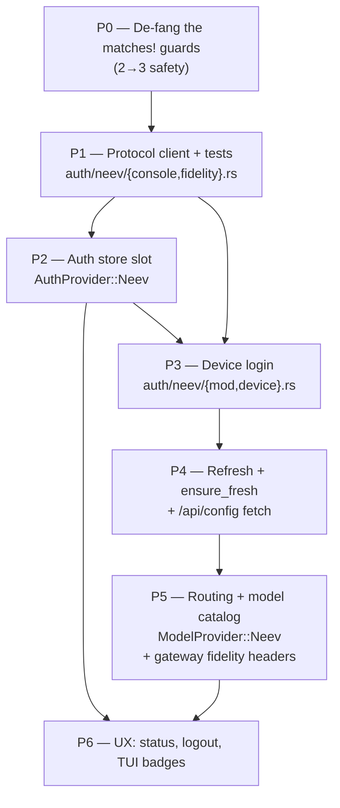

# NeevCloud Port Plan

Ordered, file-by-file. Codex is the reference implementation for **slot identity, routing, and login shape**; it is the *wrong* reference for the **wire layer** (Codex is `ApiBackend::Responses` against `chatgpt.com/backend-api/codex`, config.rs:53 — NeevCloud is plain Chat Completions).

Protocol ground truth: [`01-protocol-reference.md`](01-protocol-reference.md). Harness map: [`02-harness-anatomy.md`](02-harness-anatomy.md). Wire fidelity is owned end-to-end by [`07-wire-fidelity.md`](07-wire-fidelity.md) — every captured string, the constants module, the sampler clobber analysis, and the capture-diff ritual live there. This plan only says *which phase does which part of it*; it does not restate the strings.

---

## Decision points (recommendation first)

| # | Decision | Recommended | Why |
|---|---|---|---|
| D1 | Wire id | **`neev`** | Matches the short-id convention (`"xai"`, `"codex"`, model.rs:17/20). Must be byte-identical in 6 places (see P2). `neevcloud` also works; pick once, never re-litigate. |
| D2 | New crate vs module | **Module** `xai-grok-shell/src/auth/neev/` | Codex added zero crates. Root `Cargo.toml:1` is generated. |
| D3 | Wire backend | **Reuse `ApiBackend::ChatCompletions`** (`xai-grok-sampling-types/src/types.rs:1013`, the `#[default]`) | `SamplingClient::endpoint()` (client.rs:844) is `{base}/{path}` → `{baseURL}/chat/completions`. `AuthScheme::Bearer` is the default. `Usage` (types.rs:536-570) already has `completion_tokens_details.reasoning_tokens`. Zero sampler code. |
| D4 | Model catalog: dynamic prefetch vs static rows | **Static rows in `default_models.json` + re-append**, exactly like Codex (config.rs:3185-3201) | The dynamic path (`ModelFetchAuth::resolve`, `ListModelsEndpoint::from_endpoints`) is single-endpoint/single-credential by construction, and `resolve_model_list` is **sync**. NeevCloud has no `/v1/models` — its list is `/api/config`, a different shape. Static is a 10-line JSON diff vs a 3-subsystem refactor. Revisit if the whitelist churns. |
| D5 | Where the runtime `baseURL` lands | **`EndpointsConfig.neev_base_url`, seeded at login, read by the pure `resolve_provider_route`** | `resolve_provider_route` is documented as the single pure authority ("do not re-implement parallel if/else base tables", config.rs:4440-4447). Do not make it async. Fall back to `{console}/zen/go/v1` when cold so catalog stamping (config.rs:3484) never yields a blank base. |
| D6 | `options.apiKey` → `ModelEntry.api_key`? | **No.** Leave `api_key: None` | `ModelEntry` is `Serialize` and `ModelsCacheManager::persist` writes it to `models_cache.json`. Per protocol gotcha #2 the apiKey **is** the account bearer. It also flips `has_own_credentials()` (config.rs:4044) → BYOK, un-hiding Neev rows. The credential slot already holds the identical bytes. |
| D7 | `--oauth` / `--devbox` on `--provider neev` | **`bail!`** | No browser flow exists. Codex bails on devbox at flow.rs:903-907; mirror. |
| D8 | Refresh | **Implement it anyway** | 1-year static bearer, refresh returns the same bytes — but `token_type.rs:28-29` degrades `Oidc`-without-refresh_token to unrefreshable `LegacySession`, and `status.rs` `usable` keys off refresh_token. Store the same string in `key` and `refresh_token`. |
| D9 | Wire identity | **Impersonate the neev CLI** — same UA, same `x-opencode-*`, same `client_id` | **Adopted, closed** (Cristian). Forward-compat insurance: if NeevCloud ever gates/meters/rate-limits on client identity, a byte-identical client keeps working. Measured: **nothing on the wire is required today** — bare requests, mismatched UA, and a malformed `x-opencode-session` all return 200 ([07 §1](07-wire-fidelity.md#1-the-decision-and-the-honest-caveat)). Corollary: fidelity can never *cause* a bug; if a Neev call fails, look elsewhere first. Constants land in P1, gateway headers in P5. |
| D10 | How identity B's UA reaches the wire | **Conditional insert at `xai-grok-sampler/src/client.rs:500`** (~2 lines) | `extra_headers` are applied at `client.rs:443-449`, then `headers.insert(USER_AGENT, …)` runs unconditionally at `:489-501` — `insert` replaces, so a UA passed through `extra_headers` is silently dropped. `SamplerConfig.origin_client` (sampler `config.rs:201-205`) is the *supported* seam but **composes** (`{product}/{ver} grok-shell/{ver} ({os}; {arch})`, client.rs:376-386) — it cannot be byte-exact and it announces `grok-shell` to NeevCloud, failing D9. Analysis + diff + the honest trade: [07 §4](07-wire-fidelity.md#4-the-sampler-clobber-problem). **This is the one place the port reaches outside the new module** — see P5. |

**Scope flag for Cristian:** `.planning/PROJECT.md` Out-of-Scope says *"Supporting arbitrary third-party providers beyond xAI + Codex/OpenAI in v1"*. NeevCloud is exactly that. This is a v1-scope call, not an implementation call. Confirm phase placement (Phase 8+, or a decimal insert) before P0.

---

## Phase dependency graph



P0 is a prerequisite for everything because it is the only phase that makes the compiler your checklist. Doing it last means debugging silent xAI-fallthrough on top of every other failure mode.

---

## P0 — De-fang the two-way guards

**Why first:** three fixed-arity types fail loudly when you add the variant (good). The `matches!` guards do **not** — a third variant silently takes the xAI branch. A Neev logout could clear the xAI slot; a Neev login could trigger xAI `post_login_sync`.

| File | Site | Change |
|---|---|---|
| `auth/flow.rs` | `:901` `if matches!(provider, Some(AuthProvider::Codex))` | Convert `run_cli_login_for_provider` to an exhaustive `match provider { Some(Codex) => …, Some(Xai) \| None => …, }` |
| `auth/flow.rs` | `:1077` `matches!(provider, AuthProvider::Codex)` (snapshot-epoch bump), `:1085` `matches!(provider, AuthProvider::Xai)` (`api_key_still_set`) | Exhaustive `match` |
| `auth/flow.rs` | `:780-782` `report_signed_in_for_provider` label match | Already an exhaustive `match` over `Option<AuthProvider>` — it will fail to compile in P2. Leave it. |
| `extensions/auth.rs` | `:163` `if matches!(provider, AuthProvider::Xai)` | Exhaustive `match`; also the copy at `:158` (`"Use provider xai or codex"`) |
| `pager/src/app/dispatch/session/lifecycle.rs` | `:302-305` `match provider { "codex" => …, _ => Xai }` | Leave the `_` (string match, can't be exhaustive) but add a `// ponytail:` marker — P6 fixes it |

**Size:** ~40 lines. **Acceptance:** `cargo clippy -p xai-grok-shell` clean; `cargo test -p xai-grok-shell --test auth_multi_slot` green; zero behavior change (pure refactor — the diff should be reviewable as "same arms, different syntax").

---

## P1 — Protocol client + tests

New files: `crates/codegen/xai-grok-shell/src/auth/neev/console.rs` and `crates/codegen/xai-grok-shell/src/auth/neev/fidelity.rs`. Pure HTTP against the console + pure string constants. No storage, no enum changes — both land before P2 and are testable standalone.

### `auth/neev/fidelity.rs` — the single fidelity home (D9)

Spec, captured strings, and the full module body: [07 §3](07-wire-fidelity.md#3-rust-one-constants-module-authneevfidelityrs) and [07 §6](07-wire-fidelity.md#6-session-and-request-id-shapes). Do not copy the strings anywhere else — the whole point of the module is that a stale value is fixed in one grep ([07 §7](07-wire-fidelity.md#7-maintenance-the-insurance-can-become-the-outage)).

It lands **here, in the earliest protocol phase**, not in P5, because identity A (`neev/latest/0.0.2/cli`) is consumed by the very first console request and P5 only adds identity B on top. Surface: `console_headers(accept_json)`, `gateway_headers(session_id, request_id)`, `console_user_agent()` / `gateway_user_agent()`, `new_session_id()` / `new_request_id()`, plus `BUM_NEEV_*` env overrides. Confirm `rand = "0.9"` is on `xai-grok-shell/Cargo.toml` before assuming (workspace dep at root `Cargo.toml:199`); no `ulid` crate is added.

**Why per-request `.headers(…)` and not the process UA:** `shared_client()` sets `.user_agent(process_user_agent_string())` (`crates/codegen/xai-grok-http/src/lib.rs:289`) → `grok-shell/<ver> (linux; x86_64)`; `set_client_name` (`lib.rs:164`) is process-global and `.expect("set_client_name called more than once")`s on a second call, so using it would rewrite xAI and Codex traffic too and panic on a second caller. A per-request override touches only Neev calls.

**Nothing here is required — it is D9 insurance.** Measured live against `code.neevcloud.com/api/orgs` (authenticated): curl with no `-A` at all → 200; `neev/latest/0.0.2/cli` → 200; an empty UA → 200; `Python-urllib/3.13` → **403** `error_code: 1010, browser_signature_banned`. The same urllib client with any other UA — even `curl/8.0` — returns 200. Cloudflare bans a small blocklist of known-bot UA signatures; **it does not block unknown ones**, and reqwest never emits one. So the console UA is fidelity, not a Cloudflare workaround; a fidelity bug can never explain a failing console call.

### `auth/neev/console.rs`

```rust
//! NeevCloud console client (device auth + account/org/gateway config).
//!
//! Reverse-engineered from `@neevcode/neev@0.0.2`; verified live.
//! Never echoes response bodies into errors — the access_token IS the
//! gateway apiKey (one secret, one blast radius).

use std::time::Duration;

fn console_req(method: reqwest::Method, url: &str, accept_json: bool) -> reqwest::RequestBuilder {
    crate::http::shared_client()
        .request(method, url)
        // identity A — overrides the client-level UA for Neev calls only (D9)
        .headers(super::fidelity::console_headers(accept_json))
        .timeout(Duration::from_secs(30))
}
```

`accept_json = true` only where neev pipes `acceptJson` — `/api/config`. Everywhere else `*/*` (07 §2).

Mirror the `codex/device.rs:114-120` idiom (`shared_client()` + per-request 30s timeout) everywhere.

### Endpoints to implement

| Fn | Wire | Notes |
|---|---|---|
| `neev_device_code_url(base)` | `{base}/auth/device/code` | `base.trim_end_matches('/')` — same idiom as `codex_device_usercode_url` (device.rs:24-29) |
| `neev_device_token_url(base)` | `{base}/auth/device/token` | Used by **both** poll and refresh |
| `request_device_code(base, client_id) -> NeevDeviceCode` | POST JSON `{"client_id":"neev-cli","client":"neev CLI 0.0.2 on linux"}` | Response `{device_code, user_code, verification_uri_complete, expires_in, interval}` |
| `fetch_user(base, token, org) -> NeevUser` | GET `{base}/api/user`, `Authorization: Bearer`, `x-org-id` | `{id, email, workspaceName, plan:{label,…}}` |
| `fetch_orgs(base, token) -> Vec<NeevOrg>` | GET `{base}/api/orgs`, Bearer only | `[{id:"wrk_01…", name}]` |
| `fetch_gateway_config(base, token, org) -> Option<NeevGatewayConfig>` | GET `{base}/api/config`, Bearer + `x-org-id` | **404 ⇒ `Ok(None)`**, never `Err` (gotcha #4). Precedent: device_code.rs:166 maps 404 → typed `NotEnabled`. |

`NeevGatewayConfig` is the distilled `config.provider.opencode.options` — `{base_url, api_key}` plus `whitelist: Vec<String>`. The provider key is literally `"opencode"` despite the "NeevCode Zen" display name.

### The verification-URL quirk — its own function, its own test

```rust
/// The server returns `verification_uri_complete` as a **PATH**, not an
/// absolute URL. Concatenate onto the base, THEN validate — do not delete the
/// https/control-char guard to make a bare path parse.
/// (`device_code.rs:521 validate_verification_uri` url::Url::parse's and
/// requires https; a bare path fails parse.)
fn neev_verify_url(base: &str, verification_uri_complete: &str) -> String {
    format!("{}{}", base.trim_end_matches('/'), verification_uri_complete)
}
```

### `NeevLoginError`

`thiserror`, mirroring `CodexLoginError` (browser.rs:31-53). Keep `TokenExchange`, `Persist`, `Timeout`, `OAuthError`, `Other`. Drop `StateMismatch`/`BindFailed` (no PKCE loopback). **Add:**

```rust
#[error("NeevCloud rejected the client (HTTP 403, Cloudflare error_code 1010 \
         browser_signature_banned) — an edge block, not an auth failure.")]
BlockedClient,
```

Defensive only (~5 lines): a reqwest client is not on Cloudflare's UA blocklist, but a 403 reads like an auth failure and the vendor's edge rules are theirs to change. Naming the variant costs nothing.

The **independent** and more important bug: `codex/device.rs:249` classifies `403 | 404` as *pending* and `continue`s ("openai/codex treats 403/404 as pending until timeout"), so a verbatim port swallows **any** unexpected 403 — Cloudflare or otherwise — spinning silently until `MAX_WAIT` (15 min, device.rs:21) and never reaching the generic arm at `:253`. That trap is in the code being copied and holds regardless of UA.

### Acceptance

- One `#[cfg(test)] mod tests`: `neev_verify_url` concat; `/api/config` 404 → `Ok(None)`.
- Every fn takes `base: &str, client_id: &str` — mandatory for the mock-console harness (device.rs:269-306).
- `fidelity.rs` unit tests (bodies in 07 §3/§6): `console_user_agent() == "neev/latest/0.0.2/cli"` (a failure means someone bumped a const — re-derive per 07 §7, do not "fix" the test); `gateway_headers` carries **no** UA and has exactly 4 entries (the absence is load-bearing, D10); `new_session_id()` is `ses_` + 26 alphanumerics, unique across two calls.
- Console requests carry identity A: assert the mock console saw `user-agent: neev/latest/0.0.2/cli` on `/api/orgs` — i.e. the per-request `.headers(…)` actually beat `shared_client()`'s process UA. This is the cheap half of the [07 §8](07-wire-fidelity.md#8-verification-prove-fidelity-dont-assume-it) capture-diff, and the only half that fits in CI.

**Size:** ~280 LOC console + ~120 LOC fidelity + ~90 test.

---

## P2 — Auth store slot

**The store needs nothing.** `AuthDocument.providers` is `BTreeMap<String, AuthStore>` (model.rs:80) and `mutate_provider_store_or_prune` / `read_provider_auth_store` / `clear_provider_slot` are already parameterized by `AuthProvider`. Adding a slot is one const + one variant + fixing arity-2.

### `auth/model.rs`

```rust
/// Stable wire key for the NeevCloud provider slot in multi-slot `auth.json`.
pub const PROVIDER_NEEV: &str = "neev";          // next to :17 / :20

pub enum AuthProvider {
    Xai,
    Codex,
    /// NeevCloud device-code slot (`providers.neev`).
    Neev,
}
// as_str:36  → PROVIDER_NEEV
// label:44   → "NeevCloud"
// parse:52   → PROVIDER_NEEV => Some(Self::Neev)
// all():61   → [Self; 2] -> [Self; 3], appending Self::Neev
```

**Do NOT bump `AUTH_DOCUMENT_VERSION`** (model.rs:73). A new providers key is additive — old binaries read `version: 1` and `read_provider_auth_store` returns `Ok(None)` for a slot they don't know. Version 2 makes every older `bum` hard-fail on the **whole file** (`ErrorKind::Unsupported`, storage.rs:125-129) and lose the xAI + Codex logins. This is the single most important don't in the port.

`GrokAuth` (model.rs:121) needs **zero new fields**:

| NeevCloud | `GrokAuth` field |
|---|---|
| `access_token` | `key` |
| `refresh_token` (byte-identical) | `refresh_token` — store it anyway (D8) |
| `expires_in` (~1yr) | `expires_at: Some(Utc::now() + Duration::seconds(expires_in))` |
| console base URL | `oidc_issuer` — safe: `is_xai_auth()` (model.rs:206) exact-matches xAI issuer constants only |
| `"neev-cli"` | `oidc_client_id` |
| `/api/user` `id` | `user_id` |
| `/api/user` `email` | `email` |
| `/api/orgs[0].id` (`wrk_01…`) | `organization_id` — precedent: `CodexAuthMaterial::from_auth` maps `organization_id` → `account_id` (ensure_fresh.rs:30) |
| `/api/orgs[0].name` | `organization_name` |
| `plan.label` | **nothing** — `ProviderAuthStatus.plan` is derived, `GrokAuth` has no plan field. Leave `None`; `format_auth_status` renders an em-dash. |

### Compile-forced fixes (the compiler is your checklist)

- `auth/status.rs:37` `providers: [ProviderAuthStatus; 2]` → `; 3`; add the third element to `from_document:75` and `empty:91`. `format_auth_status:234` iterates — free.
- `auth/meta.rs:31` `ProviderAuthMetaSlots { xai, codex }` → add `#[serde(default)] pub neev: ProviderSlotUsableMeta`; add the arm to the exhaustive `from_report` match at `:43-50`. `#[serde(default)]` keeps older ACP clients deserializing (regression test at meta.rs:175).
- `pager-bin/src/main.rs:1753-1760` and `:1778-1785` — two near-identical `match p` blocks. Both.
- `pager/src/app/cli.rs:11` `AuthProviderArg` → add `Neev`. **clap `ValueEnum` kebab-cases variants and this enum has no `#[value(name=…)]` overrides** — `Xai`→`xai` and `Codex`→`codex` work by luck. `Neev`→`neev` also works; `NeevCloud` would silently become `--provider neev-cloud`.
- `auth/flow.rs:780-782` — add `Some(AuthProvider::Neev) => Some("NeevCloud")`.
- `auth/mod.rs` — `pub mod neev;` next to `:4`; re-export `PROVIDER_NEEV` in the `pub use model::{…}` block at `:44-47`.

`storage.rs:562` (`clear_all_provider_slots` loops `AuthProvider::all()`) generalizes for free — `bum logout --all` becomes a 3-slot atomic clear.

`storage.rs:852` `write_fixture_auth_document(path, xai, codex)` is `#[cfg(test)]` with positional slots — add a third param.

### Acceptance — one test earns its keep

New case in `tests/auth_multi_slot.rs`: seed `providers.xai` + `providers.codex` + `providers.neev`, mutate **only** neev, assert (a) the xai/codex scope keys survive byte-identical, (b) `version` stays `1`, (c) `mode & 0o777 == 0o600` (mirrors storage.rs:934/1024), (d) clearing only neev leaves the file present; clearing all three returns `FileDeleted`. That one test covers slot isolation, the version trap, permissions, and prune.

**Size:** ~120 LOC across 8 files + ~60 test.

---

## P3 — Device login command

New: `auth/neev/mod.rs` + `auth/neev/device.rs`. Mirror `codex/mod.rs` and `codex/device.rs` file-for-file.

### `auth/neev/mod.rs`

```rust
//! NeevCloud device-code login for the `providers.neev` slot.
//!
//! Reverse-engineered from the Bun-compiled `@neevcode/neev@0.0.2`; verified
//! against the live service. Device-code only — no browser/PKCE flow exists.
//!
//! Never reads neev's own world-readable (0644) SQLite store. Never writes the
//! xAI or Codex slots.

/// NeevCloud console base (prod). Dev: `https://dev.code.neevcloud.com`.
pub const NEEV_CONSOLE_URL: &str = "https://code.neevcloud.com";
/// Device-flow client id (constant `HK` in the vendor binary).
pub const NEEV_CLIENT_ID: &str = "neev-cli";
/// Stable multi-slot scope key under `providers.neev` ({issuer}::{client_id},
/// per the convention at codex/mod.rs:54).
pub const NEEV_AUTH_SCOPE: &str = "https://code.neevcloud.com::neev-cli";

/// Console base with `NEEVCLOUD_CONSOLE_URL` override (trailing slashes stripped).
///
/// ponytail: not `GROK_`-prefixed — this is the vendor's own env name, kept
/// verbatim on purpose. Do not "fix" it to match CONVENTIONS.md.
pub fn resolve_neev_console_url() -> String {
    std::env::var("NEEVCLOUD_CONSOLE_URL")
        .ok()
        .map(|s| s.trim().trim_end_matches('/').to_owned())
        .filter(|s| !s.is_empty())
        .unwrap_or_else(|| NEEV_CONSOLE_URL.to_owned())
}
```

Shape matches `resolve_codex_base_url` (config.rs:331-337): blank/whitespace → default.

### `auth/neev/device.rs`

Poll loop rules, taken from the more rigorous xAI implementation (`device_code.rs:230-288`) rather than Codex's flat `MAX_WAIT`:

- **Sleep first** (codex/device.rs:200; rationale at device_code.rs:231 — an immediate poll on a fresh code only returns `authorization_pending` and risks `slow_down`).
- Deadline from the server's `expires_in`, floored at `MIN_DEVICE_CODE_EXPIRY_FALLBACK_SECS = 600` (device_code.rs:22) — NeevCloud actually returns `expires_in`, unlike Codex.
- `authorization_pending` → continue. `slow_down` → `poll_interval += 5s` (device_code.rs:21). `access_denied` / `expired_token` → terminal, **no write**.
- Reuse `DEVICE_GRANT_TYPE` (device_code.rs:19) — identical literal, do not re-declare. It is a **private** `const` today; bump it to `pub(super)` or the sibling `auth::neev` module cannot see it (won't compile as written).
- Reuse `parse_interval` semantics (codex/device.rs:93) — tolerates number-or-string.
- Add a `403` arm returning `NeevLoginError::BlockedClient` **before** the `403 | 404 => continue` pending arm (device.rs:249) — not merely before the generic bucket, or any 403 is swallowed as pending until the 15-min timeout.
- Keep the `user_code` charset guard (`[A-Za-z0-9-]`, device.rs:142-150) and the **never-echo-the-body** rule (device.rs:252).

Persist via the `persist_codex_tokens` idiom verbatim (browser.rs:195-214), including the `FileDeleted` guard:

```rust
let outcome = mutate_provider_store_or_prune(auth_file, AuthProvider::Neev, move |store| {
    store.insert(NEEV_AUTH_SCOPE.to_owned(), to_store);
})
.map_err(|e| NeevLoginError::Persist(e.to_string()))?;
match outcome {
    ProviderStoreMutation::DocumentWritten | ProviderStoreMutation::Unchanged => {}
    ProviderStoreMutation::FileDeleted => {
        return Err(NeevLoginError::Persist("unexpected file delete after Neev persist".into()));
    }
}
```

Persist **only after** the token exchange succeeds (codex/device.rs:180). `build_auth` does `GET /api/orgs` then `GET /api/user` right after token success and folds `organization_id` / `email` / `user_id` in — without a persisted org, `/api/config` can't be resolved on a cold start.

CLI copy: reuse the `eprintln!` block at device.rs:274-291 verbatim, swapping "Codex" → "NeevCloud" and the URL to `neev_verify_url(base, &resp.verification_uri_complete)`. Keep the dim `\x1b[90m` warning and `webbrowser::open` best-effort. **No TUI screen, no `/login` slash command, no `AuthUrlInfo`/`AuthChannels` wiring** — those have zero pager consumers and Codex deliberately does not use them. Expired-code copy: "Run `bum login --provider neev` again."

### `auth/flow.rs:892 run_cli_login_for_provider`

Add the Neev arm to the (now exhaustive, per P0) match, **before** the xAI path so it early-returns ahead of `post_login_sync` — same rationale as T-05-22 at flow.rs:900 (never feed a non-xAI principal into xAI team managed-config). `bail!` on `devbox` (mirror :903-907) and on `oauth` (D7). Finish with `report_signed_in_for_provider(&auth, Some(AuthProvider::Neev))`.

### Acceptance

New `crates/codegen/xai-grok-shell/tests/auth_neev_lifecycle.rs`, mirroring `auth_codex_lifecycle.rs` (copy its module-doc header verbatim — the `grok_home()` `OnceLock` warning at `:7-13` and the per-test cargo invocations at `:16-22` are load-bearing). Axum mock console (`device_code.rs:789 spawn_token_server` is the template). Cases:

- pending → success
- `slow_down` → success (assert interval grew)
- `access_denied` → `Err`, **no file written**
- `expired_token` → `Err`, no file written
- 403 → `BlockedClient` (not the generic HTTP bucket)
- `verification_uri_complete` path concat renders `{base}{path}`
- **a neev login leaves `providers.xai` and `providers.codex` byte-identical** (mirror device_code.rs:881-886, which asserts the codex slot survives an xAI device login)

`cargo test -p xai-grok-shell --test auth_neev_lifecycle`. Never an unfiltered workspace run.

**Size:** ~350 LOC + ~250 test.

---

## P4 — Refresh + ensure_fresh + gateway config

New: `auth/neev/refresh.rs`, `auth/refresh/neev_refresher.rs`, `auth/neev/ensure_fresh.rs`.

### `auth/neev/refresh.rs` ← `codex/refresh.rs`

POST JSON `{"grant_type":"refresh_token","refresh_token":…,"client_id":"neev-cli"}` to the same `{base}/auth/device/token`. Copy `classify_terminal` (refresh.rs:25 — `invalid_grant`→`RefreshTokenRejected`, `invalid_client`→`ClientRejected`) and the identity-preserving `merge_*_refresh_response` shape (`:46`: omitted refresh_token → keep prior; omitted claims → keep prior `organization_id`/`email`/`user_id`).

**No `neev/claims.rs`.** Codex derives expiry from JWT claims via `jsonwebtoken::dangerous::insecure_decode` (claims.rs:59). NeevCloud's token is a 67-char opaque `sk-…`, not a JWT — `decode_codex_claims` returns empty and `resolve_expires_at:89` falls back to `CONSERVATIVE_EXPIRES_FALLBACK = 5 min` (claims.rs:16), which would re-refresh a 1-year token every 5 minutes. Take `expires_in` from the token response.

### `auth/refresh/neev_refresher.rs` ← `refresh/codex_refresher.rs` (101 lines, the whole template)

Keep `with_token_url` (`:30`) — the mock-IdP seam. Keep the purity contract (`refresh/mod.rs:141-144`: data-only, MUST NOT mutate).

**Do not wire into `build_refresher`** (`refresh/mod.rs:148`). It dispatches on `auth_provider_command: Option<String>` and only ever returns `Oidc | External`. `CodexRefresher` is constructed out-of-band inside `ensure_fresh_codex_auth` and never passes through it. Extending `build_refresher` would drag the xAI refresh path into the blast radius for zero gain.

### `auth/neev/ensure_fresh.rs` ← `codex/ensure_fresh.rs`

Preserve the **ternary** `EnsureFreshNeevResult { Fresh(NeevAuthMaterial), Unusable, Unavailable }` (ensure_fresh.rs:44-51). The comment at `:38-42` says the split was a deliberate CR-02 fix: `Unusable` = permanent (drop the key), `Unavailable` = transient lock/IO/timeout (keep the prepared token). Collapsing them logs the user out on a network blip.

```rust
pub struct NeevAuthMaterial {
    pub bearer: String,
    /// `wrk_…` org id — required as `x-org-id` on **console** calls only.
    /// The gateway (`/zen/go/v1/chat/completions`) wants Bearer alone.
    pub org_id: Option<String>,
    /// Gateway base from `/api/config` → `provider.opencode.options.baseURL`.
    pub base_url: Option<String>,
}
```

Copy the `refresh_mutex()` single-flight static (`:199`) and `resolve_auth_file` (`:208`) + the `#[cfg(any(test, feature = "unstable", debug_assertions))]` test hooks (`:88-177`).

**`/api/config` mapping:** `Ok(None)` (404) → `EnsureFreshNeevResult::Unusable` (slot exists, no gateway config — permanent for this org), **not** `Unavailable`. Getting this backwards means a config-less org retries forever, silently. A network error fetching `/api/config` → `Unavailable`.

The 5-minute early-refresh window neev uses is already the default: `DEFAULT_EARLY_INVALIDATION_SECS = 300` (model.rs:8). **Add no new constant.**

### Acceptance

Extend `auth_neev_lifecycle.rs`: refresh success merges identity; `invalid_grant` → `Unusable` + slot cleared; network error → `Unavailable` + slot intact; `/api/config` 404 → `Unusable`; `/api/config` 500 → `Unavailable`. `token_type.rs::from_auth` on a persisted Neev credential returns `OidcSession` (not `LegacySession`) — the D8 regression guard.

**Size:** ~450 LOC + ~200 test.

---

## P5 — Routing + model catalog

### `agent/config.rs` — enum + endpoints

```rust
pub enum ModelProvider { #[default] Xai, Codex, Neev }
// as_str:3404       → "neev"   (MUST equal PROVIDER_NEEV — convention-only, unenforced)
// display_label:3412 → "NeevCloud"
```

Adding the variant makes the three matches in `resolve_provider_route` (`:4463` slot, `:4471` base, `:4475` policy) non-exhaustive — the compiler hands you the checklist. Also `:3485` (`api_base_url`, → `None`, mirroring Codex) and `:3746` (override rebind).

`EndpointsConfig` (`:148`) gains two fields, mirroring the `codex_base_url:162` / `resolve_codex_base_url:331` / `env GROK_CODEX_BASE_URL:569` triple:

```rust
/// NeevCloud console base. Env: `NEEVCLOUD_CONSOLE_URL`.
pub neev_console_url: String,
/// NeevCloud inference gateway base, seeded from `/api/config`
/// (`provider.opencode.options.baseURL`) at login. Blank → `{console}/zen/go/v1`.
pub neev_base_url: String,
```

with `const NEEV_CONSOLE_URL_DEFAULT` / `NEEV_GATEWAY_PATH: &str = "/zen/go/v1"` next to `CODEX_BASE_URL_DEFAULT:53`.

### `is_first_party_neev_url(url, endpoints)` ← `is_first_party_codex_url:4499`

Host **and** path prefix. That function's doc (`:4494-4497`) says host-only matching is insufficient. Allowlist `code.neevcloud.com` / `dev.code.neevcloud.com` (+ whatever `NEEVCLOUD_CONSOLE_URL` names) **with path prefix `/zen/go/v1`**.

Note the honest asymmetry: for xai/codex `session_oauth_allowed` distinguishes a session token from a BYOK key, but per gotcha #2 NeevCloud's access_token **is** its apiKey, so the distinction is cosmetic here. Implement it anyway — it keeps the match arms honest, and it is the guard that stops a compromised `/api/config` from naming an arbitrary host to receive the account secret. **This is the one genuine security decision in the port:** the *server* names the host that gets the bearer. Validate before it becomes `SamplerConfig.base_url`.

Watch the trap: `session_oauth_allowed = false` fails closed to **no key** for non-Xai providers (`:4884-4892`). If the allowlist rejects the real `https://code.neevcloud.com/zen/go/v1`, every Neev sample silently ships an empty bearer. Neev's gateway is on the **same host** as the console — unlike Codex, where base and auth hosts differ.

### Dual-key → triple-key (positional tuples, not a map)

| Site | Change |
|---|---|
| `config.rs:4546 resolve_credentials` | `match model.info.provider` at `:4549` → 3-way tuple |
| `config.rs:4563 session_key_for_model_provider` | third param + arm |
| `config.rs:4578 prepare_sampling_credentials` | third param |
| `config.rs:4812 resolve_credentials_for_provider` | third param; slot match `:4834` → `Neev => non_blank_session_key(neev_session_key)` |
| `config.rs:4966 try_resolve_model_credentials` | `:4979` match |
| Callers | `agent/models.rs:958`, `agent/subagent/mod.rs:1027-1033`, `agent/mvp_agent/agent_ops.rs:1105-1120` |

The two `provider == ModelProvider::Xai` `XAI_API_KEY` fall-throughs (`:4844`, `:4868`) already exclude non-Xai, so Neev lands in the fail-closed `else` — no D-15 leak. The failure mode to fear is the opposite: **a caller passing `None` in the wrong positional slot means Neev requests silently authenticate with the Codex token**, which `models.rs:955` explicitly calls out as the thing to never do. Adding a fourth provider should turn this into a map; three is not the moment.

`snapshot_neev_session_key_from_auth_store()` + `invalidate_neev_session_key_snapshot()` ← clone `:4700`/`:4756` (same mtime/len/epoch cache, `PROVIDER_NEEV` slot, same fail-closed-on-error warn). **Call `invalidate_*` after login and after selective logout** (`flow.rs:1077`, already de-fanged in P0) — the cache keys on `(path, mtime, len, epoch)` and a same-second write can collide on mtime+len, so without the epoch bump the first post-login model switch still sees an empty slot.

### `session/acp_session_impl/sampler_turn.rs:294-330`

Clone the `codex_session_oauth` gate:

```rust
let neev_session_oauth = model_facts.provider == Some(ModelProvider::Neev)
    && creds.auth_type == xai_chat_state::AuthType::SessionToken
    && crate::agent::config::is_first_party_neev_url(&cfg.base_url, &endpoints);
if neev_session_oauth {
    match crate::agent::config::ensure_fresh_neev_auth().await {
        EnsureFreshNeevResult::Fresh(m) => { api_key = Some(m.bearer); /* base_url already routed */ }
        EnsureFreshNeevResult::Unusable => { api_key = None; }
        EnsureFreshNeevResult::Unavailable => { /* keep prepared */ }
    }
}
```

**Do not clone `inject_chatgpt_account_id_header` (`:4779`).** `x-org-id` is a console header (`/api/config`, `/api/mcp/list`) — the gateway wants Bearer alone per verified ground truth. Keep it inside `auth/neev/`.

### Identity B on the sampler path (D9 / D10)

The gateway (`/zen/go/v1`) validates none of this — bare, mismatched-UA, and malformed-`x-opencode-session` requests all 200 ([07 §1](07-wire-fidelity.md#1-the-decision-and-the-honest-caveat)). It is insurance, and it can never be why a sample fails. Two pieces, in order:

**1. The `x-opencode-*` headers — free, no source change.** They ride `SamplerConfig.extra_headers` (`IndexMap<String, String>`, constructed empty at `client.rs:2098`) intact; nothing downstream touches them:

```rust
for (name, value) in fidelity::gateway_headers(&session_id, &request_id) {
    cfg.extra_headers.insert(name.to_string(), value);
}
```

Generate the ids, never replay the captured ones (07 §6): one `ses_` per bum session — cache it on the session, alongside where `sampler_turn.rs` already has session scope — and one fresh `msg_` per outbound request.

**2. The UA — needs the conditional insert first (D10).** `extra_headers` land at `client.rs:443-449`; then `client.rs:489-501` runs `headers.insert(USER_AGENT, …)` **unconditionally**, and `insert` replaces. So `extra_headers["user-agent"]` is silently dropped on this exact path. `origin_client` cannot substitute — `user_agent_string_for` (`client.rs:361-386`) composes `opencode/0.0.2 grok-shell/<ver> (os; arch)`, which is neither byte-exact nor identity B. The fix is the ~2-line guard from [07 §4](07-wire-fidelity.md#4-the-sampler-clobber-problem):

```rust
// crates/codegen/xai-grok-sampler/src/client.rs:499-501
if let Ok(v) = HeaderValue::from_str(&ua_string)
    && !headers.contains_key(USER_AGENT)
{
    headers.insert(USER_AGENT, v);
}
```

plus fixing the `:489` comment ("Always set" → "Set unless extra_headers already did") and one test asserting `extra_headers["user-agent"]` survives. Blast radius today is **zero callers**: `extra_headers` is empty by default and the existing `new_applies_extra_headers` test (`client.rs:2262-2266`) sets other headers; `default_headers.contains_key(USER_AGENT)` (asserted at `client.rs:2311`) stays true because the fidelity path supplies one.

> **This is the only place the port edits code outside `auth/neev/`.** Everything else in P1–P6 is a new module plus mechanical widening. It is vendored xAI code, so it will conflict on upstream merges around `client.rs:489-501` — two lines, trivially re-applied. Put it on the fork's merge checklist; it is not a reason to accept `origin_client`'s composite.
>
> Ship order matters: land the guard, *then* add `user-agent` to `extra_headers`. If the guard is deferred, the `x-opencode-*` headers still ship and the gateway sees `grok-shell/<ver> (…)` — a known, measured-harmless degradation (200 either way), not a blocker for the rest of P5.

`fidelity::gateway_headers` deliberately returns no UA (07 §3) so the two steps cannot silently half-land: nothing in the header list is being clobbered, and the UA is added at the one call site that knows the guard exists.

### `xai-grok-models/default_models.json` (D4)

Add rows filtered from the verified `whitelist`. Per row:

```json
{
  "model": "minimax-m2",
  "name": "MiniMax M2 (NeevCloud)",
  "description": "NeevCode Zen",
  "provider": "neev",
  "context_window": 196608,
  "max_completion_tokens": 32768,
  "supported_in_api": false
}
```

- **Omit `api_backend`** — `ChatCompletions` is the `#[default]` (types.rs:1016) and matches `/chat/completions`. Copying a Codex row wholesale gives you `"responses"` (every Codex row in `default_models.json` has `"api_backend": "responses"`) and the sampler's backend match takes `conversation_stream_responses` (`xai-grok-sampler/src/client.rs:2055`) against a gateway that only speaks Chat Completions.
- **Omit `auth_scheme`** — `Bearer` is the default (sampler/config.rs:22).
- `supported_in_api: false` — `visible_for_auth()` (config.rs:4003) is `!hidden && (is_session_auth || supported_in_api)`, so `false` correctly hides Neev models from API-key-only users. `grok-build` does the same.
- **Model id casing:** request `minimax-m2`, response `"model":"MiniMax-M2"`. The `model` slug **must** be the lowercase request id from `whitelist[]`; the pretty casing goes in `name`. Never round-trip-compare model ids.
- Drop `cost.input`/`cost.output` — `grep -n "cost\|price\|per_token"` over `agent/config.rs` returns **zero hits**. No consumer exists. Metering belongs at `/api/usage/report` (§8), if ever.
- Drop `reasoning` — `supports_reasoning_effort`/`reasoning_efforts` describe the low/medium/high *menu*, not "this model reasons". Mapping `reasoning:true` would make the picker offer an effort submenu the gateway never advertised.
- Use `tool_call` as a **filter**, not a field: skip any model with `tool_call != true`. The harness is tool-driven and there is no capability flag to carry the fact downstream.
- `xai-grok-models/src/lib.rs:77` — **no change needed.** The test asserts `models.len() >= 4` (a floor, not an equality) plus `ids.contains(…)` for the four current ids; appending Neev rows cannot break it. There is no count to update.

### Prefetch survival — invisible until runtime

`config.rs:3178` does `resolved = prefetched;` — the remote catalog **replaces** the map, it is not a merge. That single line is why the Codex re-append (`:3185-3201`) and the WR-02 xAI re-inject (`:3202-3212`) exist. The re-append filters `entry.info.provider == ModelProvider::Codex` (`:3189`) — add Neev (`matches!(p, Codex | Neev)`) or Neev models exist on a fresh install and **vanish the moment a logged-in xAI user's prefetch succeeds**. No error, no log; the rows just aren't in the picker.

Re-read WR-02's `has_xai` logic (`:3208-3212`) with three providers in play — "first entry" changes meaning once a third provider can occupy the front of the IndexMap.

### `agent/handlers/model_switch.rs:26-29`

`Neev => crate::auth::PROVIDER_NEEV`. Nothing else: `provider_slot_usable`/`credential_usable` (status.rs:155/121) are provider-agnostic, `missing_provider_gate_error:5602` is already generic (suggestion auto-becomes `bum login --provider neev` via `:5557`), and the xAI-only `AuthManager` fallback at `:38-42` correctly excludes Neev — extending it would let a stale xAI session gate a Neev switch.

### Acceptance

- `tests/provider_routing.rs`: mirror `resolve_provider_route_codex_default:203` and `codex_model_routes_to_codex_backend_with_codex_token:453`; add `is_first_party_neev_url` accept/reject cases (accept `https://code.neevcloud.com/zen/go/v1/…`, **reject** `https://code.neevcloud.com/` bare, reject `https://evil.example/zen/go/v1`).
- `tests/model_catalog.rs`: Neev rows present in **both** `resolve_model_list(&cfg, None)` **and** `resolve_model_list(&cfg, Some(prefetched))`; mirror `to_acp_model_info_sets_meta_provider:615` for `meta["provider"] == "neev"`; assert `api_key.is_none()` on Neev entries so the D6 secret-in-cache leak cannot regress silently.
- `tests/model_switch_gate.rs`: a `missing_provider_gate_error(Neev, …)` row.
- `xai-grok-sampler`: one test that `extra_headers["user-agent"]` reaches `default_headers` unclobbered (the D10 guard's regression pin — without it the two-line change is silently revertible by a future upstream merge).
- `tests/provider_routing.rs` (or the sampler-turn test): a Neev `SamplerConfig` carries all four `x-opencode-*` headers, `x-opencode-session` matches `^ses_[0-9A-Za-z]{26}$`, and the session id is **stable across two requests in one session** while `x-opencode-request` differs.
- **Live:** one real `/chat/completions` POST through the sampler returning 200 with a usage block — proves routing, credentials, and the Chat Completions backend end to end. Note it proves *nothing* about fidelity: everything returns 200.
- **Captured-traffic header diff — the only real fidelity proof, and the P5 exit gate.** Run bum through mitmproxy and diff its outbound header set against neev's captured flows; procedure, extraction script, and secret redaction in [07 §8](07-wire-fidelity.md#8-verification-prove-fidelity-dont-assume-it). Only these lines may differ: `x-opencode-session`/`x-opencode-request` values (freshly generated — compare shape, never value), `b3`/`traceparent` (absent in bum, deliberate per [07 §5](07-wire-fidelity.md#5-trace-headers--b3-and-traceparent)), `accept-encoding` (reqwest's feature set vs Bun's), `content-length`. **Anything else is a fidelity bug — and a `user-agent` reading `… grok-shell/<ver> (linux; x86_64)` on `/zen/go/v1` means the D10 guard was not applied and `client.rs:500` overwrote it.** Manual pre-release ritual (needs a proxy, a live login, and a human reading four expected diffs), not CI; the CI half is P1's unit tests + the two sampler tests above.

**Size:** ~400 LOC across ~10 files + JSON + ~300 test, **+2 lines in `xai-grok-sampler`**.

---

## P6 — UX: status, logout, TUI

Mostly free; the dangerous parts are the string allowlists that **do not fail to compile**.

| File | Site | Change |
|---|---|---|
| `pager/src/app/app_view.rs:539` | `ProviderAuthUsableSnapshot { xai, codex }` | + `neev: bool`; `UNKNOWN:565`; **`usable_for_wire:570`** → `"neev" => Some(self.neev)` (its `_ => None` silently never badges) |
| `pager/src/app/app_view.rs:1218` | `set_provider_auth_usable(xai, codex)` | third param + callers |
| `pager/src/app/effects/mod.rs:1613` | `(Some(slots.xai.usable), Some(slots.codex.usable))` | 2-tuple → 3 |
| `pager/src/app/actions.rs:43` | `parse_provider_wire_id` | `"neev" => Some("neev")` — without it the TUI **drops the missing-provider question entirely** |
| `pager/src/slash/commands/model.rs:199` | `model_meta_provider` `match p { "xai" \| "codex" => … }` | add `"neev"` — else no needs-login badge |
| `pager/src/app/dispatch/session/lifecycle.rs:302-305` | `provider_label` `_ => Xai` | add `"neev" => ModelProvider::Neev.display_label()` (mislabels as xAI otherwise) |
| `pager/src/app/dispatch/session/lifecycle.rs:1433` | **`let is_codex = provider == "codex";`** | → `let is_cli_primary = matches!(provider.as_str(), "codex" \| "neev");` — **this is the landmine.** Leave it and "Login now" on a Neev model launches an xAI OAuth flow via `dispatch_login` at `:1444`. |
| `lifecycle.rs:1434-1439` | hard-coded `"Complete Codex login in another terminal:\n  bum login --provider codex"` | → `format!("Complete {label} login in another terminal:\n  bum login --provider {wire}")` |
| `pager/src/app/dispatch/auth.rs:25` | logout hint string | mention `neev` |
| `pager/src/settings/registry.rs:304` | `ModelAuthHint.provider` doc says `xai\|codex` | update |
| `pager/src/app/cli.rs:38` | `--provider` help text + doc at `:10` | update |

`bum auth status` needs **zero new code** past the P2 arity fix — `format_auth_status:234` iterates. `bum logout --all` is free via `AuthProvider::all()`. Bare `bum logout` stays fail-closed (Err + usage, zero mutation, flow.rs:1234-1238) so a third slot can never be silently wiped.

The poll path (`arm_provider_login_poll`, `PROVIDER_LOGIN_POLL_MAX_ATTEMPTS = 30` @ 4s, app_view.rs:559-561, `Effect::RefreshProviderAuthStatus`) is already provider-string-generic — free once the snapshot exposes the flag.

**Before declaring done: `rg '"codex"' crates/codegen/xai-grok-pager crates/codegen/xai-grok-shell`.** Every string allowlist is a silent-degradation site.

**Acceptance:** `bum login --provider neev` → device prompt → `bum auth status` shows a third block with email + `usable: yes`; `bum logout --provider neev` leaves xai/codex intact; `/model` badges a Neev row correctly; "Login now" on a Neev gate prints the CLI instruction and does **not** open an xAI OAuth window.

**Size:** ~120 LOC across ~10 files.

---

## Deliberately skipped

| Thing | Why | Add when |
|---|---|---|
| `auth/neev/browser.rs` | Device-code only; no PKCE, no loopback ports, no `generate_pkce` | never (no browser flow exists) |
| `auth/neev/claims.rs` | Opaque `sk-…`, not a JWT | never |
| `POST /api/usage/report` (§8) | Fire-and-forget in neev; no bum analog; `cost` has nowhere to land | billing matters |
| `GET /api/mcp/list` (§9) | bum has its own MCP crate | asked for |
| A `Provider` trait / registry | **NOT FOUND** — none exists. `AuthProvider` + `TokenRefresher` already are it. Abstracting for a third impl is a bigger diff than the widening and fights `resolve_provider_route`'s single-authority design. | a fourth provider arrives |
| `b3` + `traceparent` on Neev calls | Fidelity gap, accepted. bum has a W3C injector (`xai_file_utils::trace_context::inject_trace_context_into_request`, `crates/codegen/xai-file-utils/src/trace_context.rs:22-34`; propagator installed at `xai-grok-telemetry/src/otel_layer/mod.rs:87`) but **no b3 producer**, and neither header is validated. Rationale in [07 §5](07-wire-fidelity.md#5-trace-headers--b3-and-traceparent); it is an expected line in the P5 capture-diff. | NeevCloud correlates on trace ids |
| Per-provider prefetch fan-out | See D4 | Neev's whitelist churns faster than login |
| New crate, new feature flag | Codex needed neither | never |

---

## GSD

`AGENTS.md:509-519` forbids direct edits outside a GSD entry point. This is a new phase (currently Phase 7 of 9 → 8+, or a decimal insert). Produce `NN-CONTEXT.md` (boundary + the locked D1/D4/D5 decisions + Claude's Discretion), `NN-RESEARCH.md` (paste `01-protocol-reference.md` — it *is* the research), `NN-PATTERNS.md` as a closest-analog table where nearly every row's analog is the codex twin at "exact" quality (template: `.planning/phases/05-codex-oauth-dual-auth-lifecycle/05-PATTERNS.md`), then fine-grained `NN-MM-PLAN.md`/`SUMMARY.md` pairs. Enter via `/gsd-execute-phase`.

Gate per phase: `cargo fmt --all` + `cargo clippy -p <crate>` + the named `--test` binary. Never an unfiltered workspace run. P5 gates on `-p xai-grok-shell` **and** `-p xai-grok-sampler` (D10 touches it), and does not exit until the 07 §8 capture-diff is clean.

Rough total: **~1,850 LOC new + ~40 mechanical widening sites across 3 crates + 2 lines in a 4th (`xai-grok-sampler`, D10) + JSON rows.** The widening is the risk, not the OAuth — and fidelity is ~120 LOC of constants that can never fail loudly, only go stale ([07 §7](07-wire-fidelity.md#7-maintenance-the-insurance-can-become-the-outage)).
